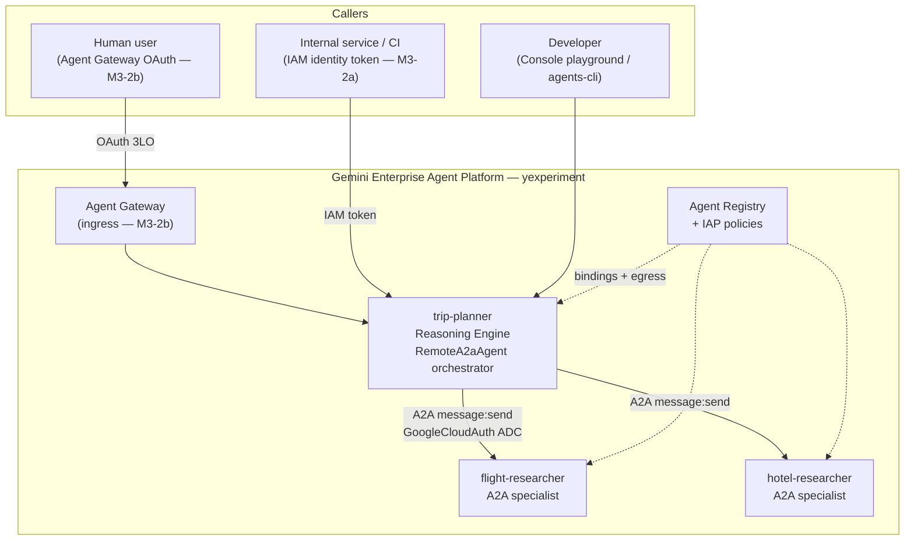
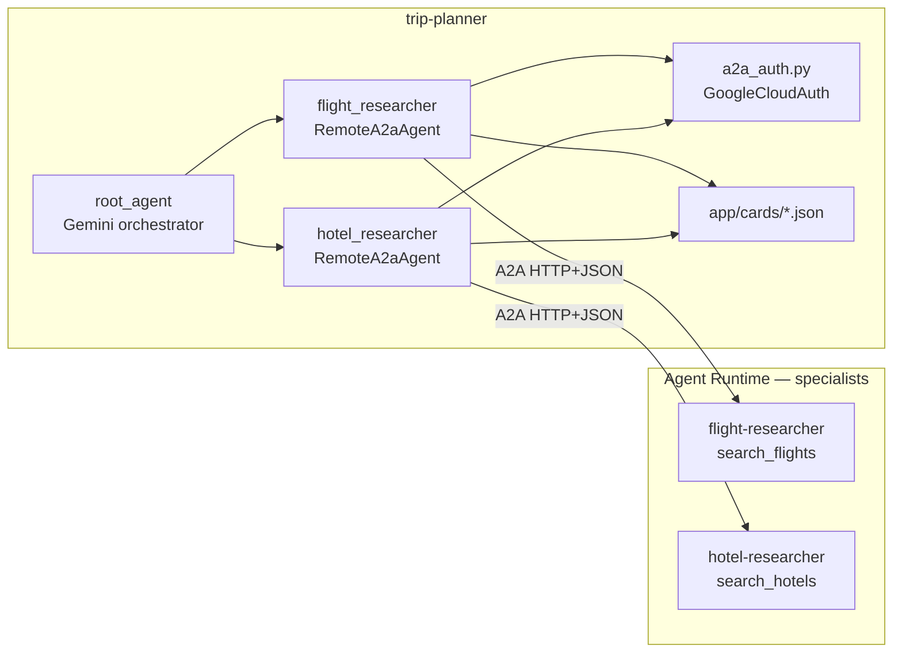
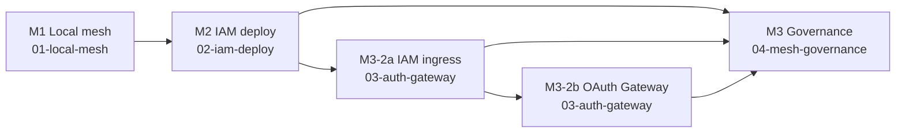

# Enterprise Trip-Planner Mesh — Overview

Three-agent **A2A mesh** on Google Cloud **Agent Platform** demonstrating enterprise governance: private deploy, IAM/OAuth ingress, and per-agent authorization.

| Agent             | Role                    | Path                                                              |
| ----------------- | ----------------------- | ----------------------------------------------------------------- |
| trip-planner      | Orchestrator (ADK)      | [`src/trip-planner/`](../../src/trip-planner/README.md)           |
| flight-researcher | Flight specialist (A2A) | [`src/flight-researcher/`](../../src/flight-researcher/README.md) |
| hotel-researcher  | Hotel specialist (A2A)  | [`src/hotel-researcher/`](../../src/hotel-researcher/README.md)   |

**Project:** `yexperiment` | **Region:** `asia-northeast1` | **Access:** private only

Live engine IDs: [`docs/notes/2026-06-21-deploy-endpoints.md`](../notes/2026-06-21-deploy-endpoints.md)

## System context

External callers never reach specialists directly. Humans and services enter through **trip-planner**; the orchestrator delegates to **flight-researcher** and **hotel-researcher** over governed A2A.

## Agentic mesh topology

Orchestration uses ADK **`RemoteA2aAgent`** sub-agents (not custom delegate tools). Specialist **AgentCards** are bundled under `src/trip-planner/app/cards/`. Governance lives on the platform (IAP, Gateway, Registry)—not in Python persona env vars.

## Milestone map

Guides follow the mesh lifecycle from local dev through platform governance.

| Guide                                          | Focus                                              |
| ---------------------------------------------- | -------------------------------------------------- |
| [01-local-mesh.md](01-local-mesh.md)           | ADK layout, unit tests, local vs deployed A2A      |
| [02-iam-deploy.md](02-iam-deploy.md)           | Private Agent Runtime deploy order and identities  |
| [03-auth-gateway.md](03-auth-gateway.md)       | IAM ingress (applied) and OAuth Gateway (deferred) |
| [04-mesh-governance.md](04-mesh-governance.md) | Registry, IAP egress, persona matrix, apply script |

## Personas (platform-enforced)

Authorization is evaluated **per agent**, not only at the entry point. Full matrix: [`.agents-cli-spec.md`](../../.agents-cli-spec.md). Platform tests require M3-2b (OAuth + Google Groups)—see [04-mesh-governance.md](04-mesh-governance.md).

## Terraform

Platform service accounts and IAM templates: [`terraform/`](../../terraform/main.tf). Deploy operations impersonate **`agent-operator-sa`**. Registry IDs: [`terraform/registry/mesh-agents.env`](../../terraform/registry/mesh-agents.env).

## Related notes

- A2A refactor rationale: [`docs/notes/2026-06-21-a2a-mesh-refactor.md`](../notes/2026-06-21-a2a-mesh-refactor.md)
- Acceptance checklist: [`docs/notes/ACCEPTANCE.md`](../notes/ACCEPTANCE.md)
