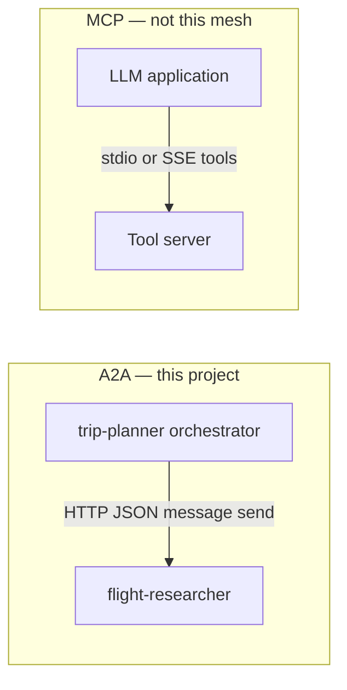
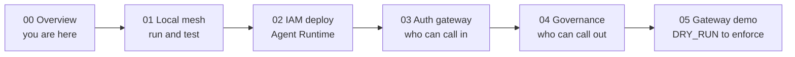
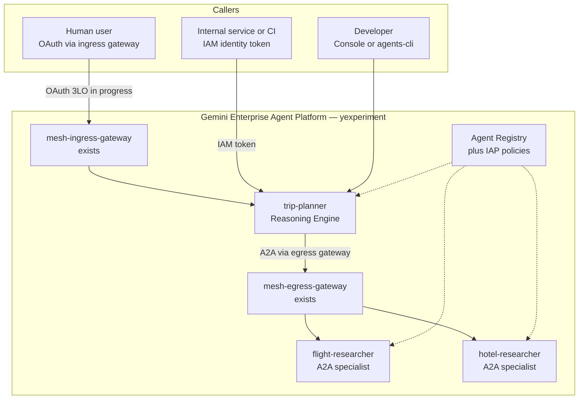
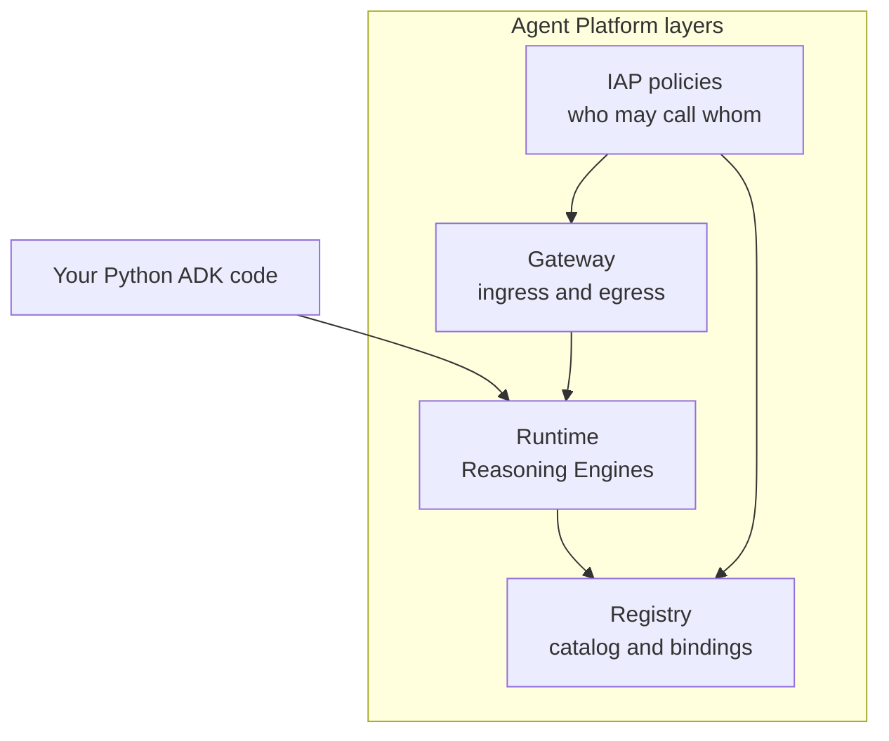
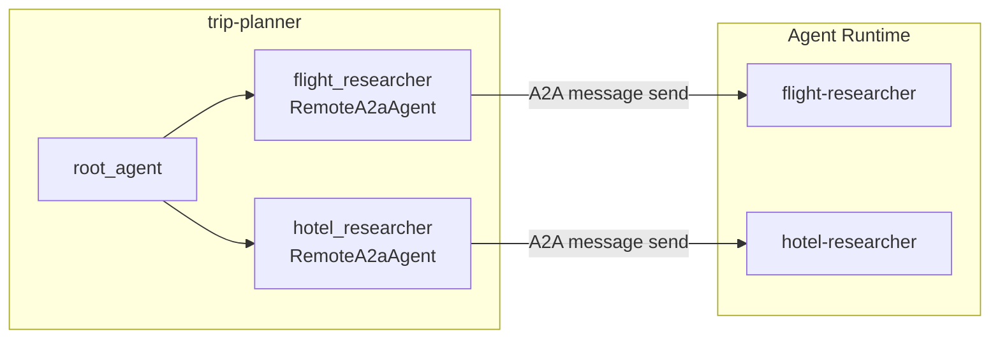
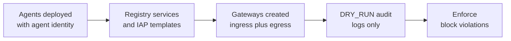

# Enterprise Trip-Planner Mesh — Overview

Welcome. This guide series teaches **Agent Platform**, **Agent CLI**, **A2A**, and **LLMOps** through a real project: a three-agent trip-planning mesh on Google Cloud.

**Who this is for:** Junior engineers comfortable with Python and basic GCP (`gcloud auth login`). No prior Agent Platform experience required.

**What you will build:** An orchestrator (`trip-planner`) that delegates flight and hotel searches to specialist agents over **A2A**, deployed privately with **IAM/OAuth ingress** and **per-agent governance**.

| Agent             | Role                    | Path                                                              |
| ----------------- | ----------------------- | ----------------------------------------------------------------- |
| trip-planner      | Orchestrator (ADK)      | [`src/trip-planner/`](../../src/trip-planner/README.md)           |
| flight-researcher | Flight specialist (A2A) | [`src/flight-researcher/`](../../src/flight-researcher/README.md) |
| hotel-researcher  | Hotel specialist (A2A)  | [`src/hotel-researcher/`](../../src/hotel-researcher/README.md)   |

**Demo project:** `yexperiment` | **Region:** `asia-northeast1` | **Access:** private only

Live engine IDs: [`docs/notes/2026-06-21-deploy-endpoints.md`](../notes/2026-06-21-deploy-endpoints.md)

---

## Glossary (read this first)

| Term                       | Plain English                                                                                 | In this repo                                                                        |
| -------------------------- | --------------------------------------------------------------------------------------------- | ----------------------------------------------------------------------------------- |
| **ADK**                    | Agent Development Kit — Python library to define agents, tools, and apps                      | `google-adk` in each `app/agent.py`                                                 |
| **Agent CLI**              | Command-line tool for scaffold, local run, eval, and deploy                                   | `agents-cli` (`uv tool install google-agents-cli`)                                  |
| **Agent Platform**         | Google Cloud managed service for running agents (Runtime, Registry, Gateway, IAP)             | Deploy target `agent_runtime`                                                       |
| **A2A**                    | Agent-to-Agent protocol — HTTP+JSON messages between agents (`message:send`)                  | trip-planner → flight/hotel via `RemoteA2aAgent`                                    |
| **AgentCard**              | JSON manifest describing an A2A agent (skills, URL, capabilities)                             | Bundled in `src/trip-planner/app/cards/`                                            |
| **Reasoning Engine**       | A deployed agent instance on Agent Runtime (has a numeric **engine ID**)                      | e.g. trip-planner `2464937943706370048`                                             |
| **Agent Registry**         | Catalog of agents with UIDs, services, and bindings (governance layer)                        | See `terraform/registry/mesh-agents.env`                                            |
| **Binding**                | A link in the Registry that connects two agents (or an auth provider to an agent)             | trip-planner→specialist bindings pending `AUTH_PROVIDER_BINDING`                    |
| **Auth provider**          | OAuth connector that proves _who the human user is_ (Google Groups, claims)                   | Planned: `mesh-oauth-3lo` connector in `yexperiment`                                |
| **Delegate authorization** | Gateway extension that forwards user identity claims so downstream A2A calls respect personas | `mesh-iap-authz-ext` in DRY_RUN; see [05 — Gateway demo](05-gateway-policy-demo.md) |
| **DRY_RUN**                | Audit-only policy mode — decisions are logged but not enforced                                | IAP egress + gateway authz start here before Enforce                                |
| **Egress gateway**         | Outbound path: orchestrator → specialists (governed A2A)                                      | `mesh-egress-gateway` (exists in `yexperiment`)                                     |
| **Ingress gateway**        | Inbound path: human browser → trip-planner (OAuth entry)                                      | `mesh-ingress-gateway` (exists in `yexperiment`)                                    |
| **MCP**                    | Model Context Protocol — tools/resources for LLM apps (different from A2A)                    | **Not used** for inter-agent calls in this mesh                                     |
| **LLMOps**                 | Operating LLM agents: eval, traces, logging, monitoring                                       | `agents-cli eval`, Cloud Trace, optional log buckets                                |
| **ADC**                    | Application Default Credentials — how code authenticates to GCP                               | `gcloud auth application-default login`                                             |
| **IAP**                    | Identity-Aware Proxy — Google Cloud access control on HTTPS resources                         | Ingress/egress policies on registry agents                                          |
| **Agent Gateway**          | Human-facing entry with OAuth for browser users                                               | Gateways exist; OAuth persona path still in progress                                |

### A2A vs MCP (important)

### How to read this diagram — how-to-read-this-diagram-how-t (1)

- **Left box (A2A):** How agents talk to _other agents_ in this repo — trip-planner delegates over HTTP.
- **Right box (MCP):** How an LLM app talks to _tools_ (files, APIs); we do **not** use this for flight/hotel specialists.
- **Solid arrow:** Real call direction in production mesh.
- **Takeaway:** If you see "MCP" in other tutorials, that is a different integration pattern — our mesh is **A2A-only** between agents.

This mesh uses **A2A** so one agent can delegate work to another on Agent Platform. **MCP** connects an LLM to tools; learn it separately — it is not how flight/hotel specialists are invoked here.

---

## Learning path (syllabus)

Follow the guides in order. Each guide has **Concepts → Walkthrough → Verify → Troubleshooting**.

### How to read this diagram — how-to-read-this-diagram-how-t (2)

- **G0 (Overview):** Vocabulary, system map, and syllabus — read before touching code.
- **G1 (Local mesh):** Unit tests, `agents-cli run`, eval — no deploy required to start.
- **G2–G4:** Progressive cloud hardening — deploy, ingress IAM, registry + IAP egress.
- **G5 (Gateway demo):** Live OAuth ingress + delegate authorization + persona tests.
- **Arrow direction:** Each guide assumes the previous one; skipping G2 before G1 is OK for reading, but labs build on prior steps.

| Guide                                                  | You will learn                                                  | Time estimate |
| ------------------------------------------------------ | --------------------------------------------------------------- | ------------- |
| [01-local-mesh.md](01-local-mesh.md)                   | Project layout, unit tests, first `agents-cli run`, eval basics | 1–2 hours     |
| [02-iam-deploy.md](02-iam-deploy.md)                   | Deploy to Agent Runtime, engine IDs, smoke test                 | 1–2 hours     |
| [03-auth-gateway.md](03-auth-gateway.md)               | IAM vs OAuth ingress, programmatic access                       | 45 min        |
| [04-mesh-governance.md](04-mesh-governance.md)         | Registry, IAP egress, persona matrix                            | 1 hour        |
| [05-gateway-policy-demo.md](05-gateway-policy-demo.md) | Live Gateway + Policy demo (DRY_RUN → enforce)                  | 2 hours       |

---

## System context

External callers never reach specialists directly. Everyone enters through **trip-planner**; the orchestrator delegates to specialists over governed A2A.

**Current state in `yexperiment` (2026-06-21):** `mesh-egress-gateway` and `mesh-ingress-gateway` **exist**. IAP authz extension is in **DRY_RUN**. The **OAuth persona path** (connector, registry bindings, four-persona browser tests) is **still in progress** — see [05 — Gateway demo](05-gateway-policy-demo.md).

### How to read this diagram — how-to-read-this-diagram-how-t (3)

- **Top row:** Three ways people reach trip-planner — browser (OAuth), service account (IAM), or developer tools.
- **Ingress gateway:** Front door for humans; OAuth connector wiring is the remaining M3-2b work.
- **Trip-planner:** Single entry orchestrator — specialists are not public endpoints.
- **Egress gateway:** Outbound A2A from orchestrator passes through governed egress path.
- **Dotted lines to Registry:** Governance metadata (UIDs, bindings, IAP) applies to all three engines.

---

## Agent Platform layers (plain English)

Agent Platform is not one service — it is **four layers** that stack together. You touch different layers at different guides.

### How to read this diagram — how-to-read-this-diagram-how-t (4)

- **Runtime (bottom-left input):** Where your `agent.py` runs after deploy — each engine has an ID and A2A URL.
- **Registry:** Phone book + wiring diagram — links agents and (later) auth providers via **bindings**.
- **Gateway:** Network front/back doors — **ingress** for humans, **egress** for orchestrator outbound A2A.
- **IAP policies:** Authorization rules evaluated per agent; start in **DRY_RUN**, then **Enforce**.
- **Vertical flow:** Code → deploy → register → protect with gateway + IAP — guides G2–G5 walk this stack.

| Layer        | Question it answers                         | You interact via                                          |
| ------------ | ------------------------------------------- | --------------------------------------------------------- |
| **Runtime**  | Where does my agent run?                    | `agents-cli deploy`, Console playground, engine URL       |
| **Registry** | What agents exist and how are they linked?  | `--agent-identity`, `mesh-agents.env`, governance scripts |
| **Gateway**  | How do humans and outbound A2A enter/leave? | `setup_agent_gateway.sh`, ingress/egress gateway IDs      |
| **IAP**      | Which identity may invoke which agent?      | `apply_mesh_governance.sh`, persona Google Groups         |

---

## Agentic mesh topology (code level)

Trip-planner uses ADK **`RemoteA2aAgent`** sub-agents. Specialist **AgentCards** are bundled under `app/cards/`. Governance is on the platform (IAP, Gateway, Registry) — **not** in Python env vars or a `mesh_auth` module.

### How to read this diagram — how-to-read-this-diagram-how-t (5)

- **`root_agent`:** The LLM orchestrator — decides when to delegate.
- **`RemoteA2aAgent` nodes:** ADK wrappers that speak A2A HTTP to deployed specialists.
- **Bundled cards:** Each `RemoteA2aAgent` loads JSON from `app/cards/` with the specialist engine URL.
- **Specialist boxes:** Separate Reasoning Engines — flight and hotel run independently.
- **No Python mesh auth:** Persona checks happen on Platform (IAP + delegate authorization), not in application code.

Key files: `app/agent.py`, `app/a2a_auth.py` (ADC bearer for A2A HTTP), `app/cards/*.json` — detailed in [01-local-mesh.md](01-local-mesh.md).

---

## Governance stack (DRY_RUN → enforce)

Policy rollout follows **observe first, block later**. This is the arc of guides 04 and 05.

### How to read this diagram — how-to-read-this-diagram-how-t (6)

- **Deploy:** Specialists first, then trip-planner — each registers in Agent Registry.
- **Registry + IAP:** Egress policies say which principal may call flight vs hotel.
- **Gateways:** Physical ingress/egress paths; delegate authorization forwards user claims outbound.
- **DRY_RUN:** Safe rehearsal — denials appear in logs but requests may still succeed.
- **Enforce:** Production posture — `mesh-deny-user` blocked at ingress; flight-only persona cannot reach hotel A2A.

Readiness gate: `./terraform/scripts/check_mesh_gateway_status.sh` (exit **0** = prerequisites satisfied).

---

## What Agent CLI does (taught summary)

**Agent CLI** (`agents-cli`) is the day-to-day tool for building and operating ADK agents. Think of it as `npm` or `cargo` for agents — it knows your project layout and talks to Google Cloud on your behalf.

**Scaffold** creates a new agent directory from templates: `app/agent.py`, tests, eval datasets, deploy Terraform, and an `agents-cli-manifest.yaml`. In this repo, three agents already exist under `src/`; you will mostly _enhance_ and _deploy_, not scaffold from scratch.

**Install** (`agents-cli install`) runs `uv sync` inside one agent folder so dependencies match `pyproject.toml`. Always run this after clone or when dependencies change. Each agent has its **own virtualenv** — there is no single root pytest for the mesh.

**Run** sends a prompt to an agent. Locally, `agents-cli playground` opens a dev UI. Against cloud, `agents-cli run --url <engine-url> --mode adk "..."` streams a query to a deployed Reasoning Engine. For the mesh lab, you aim `--url` at **trip-planner** and let it delegate over A2A.

**Eval** (`agents-cli eval run`) runs offline test cases from `tests/eval/datasets/`, grades responses, and writes artifacts under `artifacts/`. Eval proves prompt/tool quality **before** deploy; it does not replace an end-to-end A2A smoke test against live specialists.

**Deploy** packages your agent and creates (or updates) a Reasoning Engine on Agent Runtime. Flags like `--agent-identity` register the engine with Agent Registry. Deploy order for this mesh: **flight-researcher → hotel-researcher → trip-planner**, with `GOOGLE_CLOUD_LOCATION=global` for `gemini-3.1-flash-lite`.

Typical first session: `cd src/flight-researcher && agents-cli install && uv run pytest tests/unit/ -q` → repeat for other agents → `cd src/trip-planner && agents-cli run --url ...` for a live mesh query. Full labs: [01-local-mesh.md](01-local-mesh.md).

---

## What Agent Platform layers are (taught summary)

**Agent Runtime** is the execution plane. When you deploy, Google Cloud builds a container, assigns a **Reasoning Engine ID**, and exposes HTTPS endpoints for queries and A2A. Your ADK `App` becomes a long-running service. Developers see engine IDs in the Console and in `docs/notes/2026-06-21-deploy-endpoints.md`.

**Agent Registry** is the governance catalog. Each deployed agent with `--agent-identity` gets a **registry agent UID** (stored in `terraform/registry/mesh-agents.env`). **Services** and **bindings** describe how agents connect — for example, trip-planner bound to flight-researcher with an auth provider so outbound calls carry the user's persona. Until `AUTH_PROVIDER_BINDING` is set, some bindings are skipped by automation scripts.

**Agent Gateway** provides controlled network paths. **Ingress** (`mesh-ingress-gateway`) is where browser users sign in with OAuth and reach trip-planner only. **Egress** (`mesh-egress-gateway`) is where trip-planner's outbound A2A to specialists is routed and observed. Both gateways **already exist** in `yexperiment`; completing OAuth and persona tests is the remaining work.

**IAP (Identity-Aware Proxy) policies** answer "may this identity invoke this agent?" at ingress and on agent-to-agent egress. Policies can run in **DRY_RUN** (audit-only) or **Enforce**. **Delegate authorization** is a gateway extension that propagates OAuth user claims so specialist calls respect the same persona matrix as the entry point.

Together: Runtime runs code, Registry names and links agents, Gateway controls paths, IAP enforces who is allowed. Python code delegates via `RemoteA2aAgent`; Platform code enforces the persona matrix.

---

## Personas (platform-enforced)

Authorization is evaluated **per agent**, not only at the entry point. Full matrix: [`.agents-cli-spec.md`](../../.agents-cli-spec.md). Platform tests require OAuth + Google Groups — see [04-mesh-governance.md](04-mesh-governance.md) and [05-gateway-policy-demo.md](05-gateway-policy-demo.md).

| Persona            | Flights | Hotels | Entry              |
| ------------------ | ------- | ------ | ------------------ |
| `mesh-full-user`   | Yes     | Yes    | Ingress gateway    |
| `mesh-flight-user` | Yes     | No     | Ingress gateway    |
| `mesh-hotel-user`  | No      | Yes    | Ingress gateway    |
| `mesh-deny-user`   | No      | No     | Blocked at ingress |

---

## Terraform and ops

Platform service accounts and IAM templates: [`terraform/`](../../terraform/main.tf). Deploy operations impersonate **`agent-operator-sa`**. Registry IDs: [`terraform/registry/mesh-agents.env`](../../terraform/registry/mesh-agents.env).

| Script                                           | Purpose                          |
| ------------------------------------------------ | -------------------------------- |
| `terraform/scripts/setup_agent_gateway.sh`       | Create gateways, OAuth connector |
| `terraform/scripts/check_mesh_gateway_status.sh` | Readiness gate (exit 0 = ready)  |
| `terraform/scripts/apply_mesh_governance.sh`     | Registry bindings + IAP policies |

---

## Appendix: Optional deep dives

External docs — read after your first local run (G1), not before.

1. [Agent CLI — Getting started](https://google.github.io/agents-cli/guide/getting-started/)
2. [Agent CLI — Evaluation](https://google.github.io/agents-cli/guide/evaluation/)
3. [Agent CLI — Deployment](https://google.github.io/agents-cli/guide/deployment/)
4. [Agent Platform — Runtime overview](https://docs.cloud.google.com/gemini-enterprise-agent-platform/build/runtime)
5. [Agent Platform — Agent Registry](https://docs.cloud.google.com/gemini-enterprise-agent-platform/govern/agent-registry)
6. [Agent Platform — Agent Gateway overview](https://docs.cloud.google.com/gemini-enterprise-agent-platform/govern/gateways/agent-gateway-overview)
7. [Agent Platform — Delegate authorization](https://docs.cloud.google.com/gemini-enterprise-agent-platform/govern/gateways/delegate-authorization)
8. [Application Default Credentials](https://cloud.google.com/docs/authentication/application-default-credentials)

---

## Related notes

- A2A refactor rationale: [`docs/notes/2026-06-21-a2a-mesh-refactor.md`](../notes/2026-06-21-a2a-mesh-refactor.md)
- Acceptance checklist: [`docs/notes/ACCEPTANCE.md`](../notes/ACCEPTANCE.md)
- Gateway setup session: [`docs/notes/2026-06-21-agent-gateway-setup.md`](../notes/2026-06-21-agent-gateway-setup.md)

---

## Next step

Start with **[01 — Local mesh](01-local-mesh.md)**.
