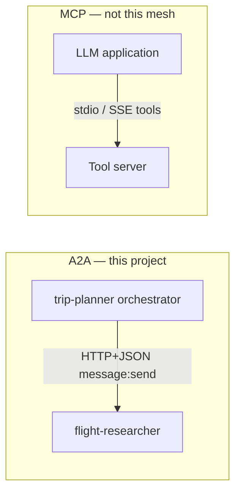
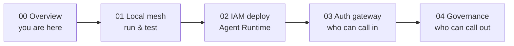
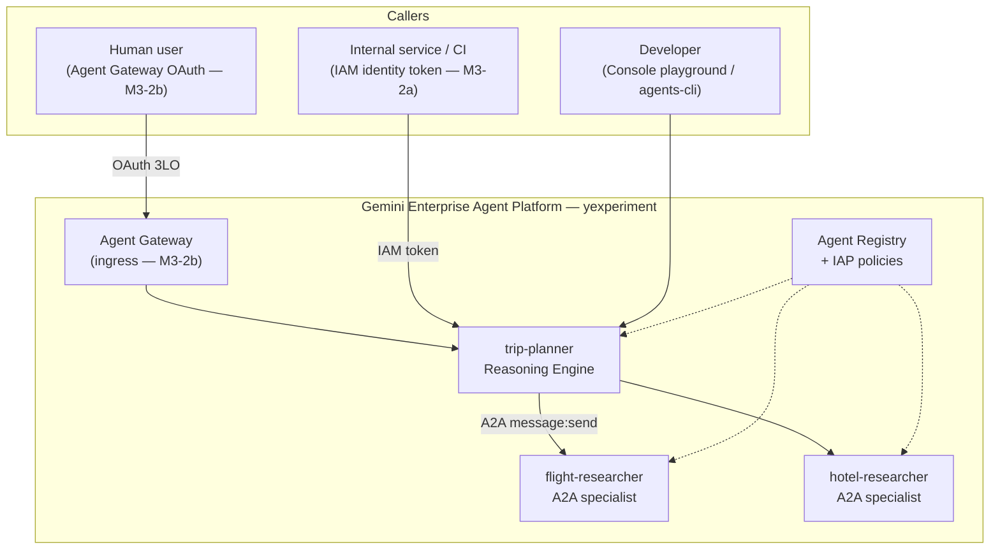
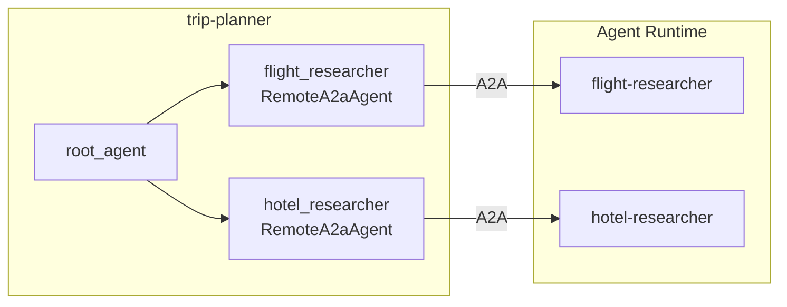

# Enterprise Trip-Planner Mesh — Overview

Welcome. This guide series teaches **Agent Platform**, **Agent CLI**, **A2A**, and **LLMOps** basics through a real project: a three-agent trip-planning mesh on Google Cloud.

**Who this is for:** Junior engineers comfortable with Python and basic GCP (`gcloud auth login`). No prior Agent Platform experience required.

**What you will build:** An orchestrator (`trip-planner`) that delegates flight and hotel searches to specialist agents over **A2A**, deployed privately with **IAM/OAuth ingress** and **per-agent governance**.

| Agent             | Role                    | Path                                                              |
| ----------------- | ----------------------- | ----------------------------------------------------------------- |
| trip-planner      | Orchestrator (ADK)      | [`src/trip-planner/`](../../src/trip-planner/README.md)           |
| flight-researcher | Flight specialist (A2A) | [`src/flight-researcher/`](../../src/flight-researcher/README.md) |
| hotel-researcher  | Hotel specialist (A2A)  | [`src/hotel-researcher/`](../../src/hotel-researcher/README.md)   |

**Demo project:** `yexperiment` | **Region:** `asia-northeast1` | **Access:** private only

Live engine IDs: [`docs/notes/2026-06-21-deploy-endpoints.md`](../notes/2026-06-21-deploy-endpoints.md)

---

## Glossary (read this first)

| Term                 | Plain English                                                                          | In this repo                                                   |
| -------------------- | -------------------------------------------------------------------------------------- | -------------------------------------------------------------- |
| **ADK**              | Agent Development Kit — Python library to define agents, tools, and apps               | `google-adk` in each `app/agent.py`                            |
| **Agent CLI**        | Command-line tool for scaffold, local run, eval, and deploy                            | `agents-cli` (install via `uv tool install google-agents-cli`) |
| **Agent Platform**   | Google Cloud managed service for running agents (Reasoning Engines, Registry, Gateway) | Deploy target `agent_runtime`                                  |
| **A2A**              | Agent-to-Agent protocol — HTTP+JSON messages between agents (`message:send`)           | trip-planner → flight/hotel via `RemoteA2aAgent`               |
| **AgentCard**        | JSON manifest describing an A2A agent (skills, URL, capabilities)                      | Bundled in `src/trip-planner/app/cards/`                       |
| **Reasoning Engine** | A deployed agent instance on Agent Runtime (has a numeric **engine ID**)               | e.g. trip-planner `2464937943706370048`                        |
| **Agent Registry**   | Catalog of agents with UIDs, services, and bindings (governance layer)                 | See `terraform/registry/mesh-agents.env`                       |
| **MCP**              | Model Context Protocol — tools/resources for LLM apps (different from A2A)             | **Not used** for inter-agent calls in this mesh                |
| **LLMOps**           | Operating LLM agents: eval, traces, logging, monitoring                                | `agents-cli eval`, Cloud Trace, optional log buckets           |
| **ADC**              | Application Default Credentials — how code authenticates to GCP                        | `gcloud auth application-default login`                        |
| **IAP**              | Identity-Aware Proxy — Google Cloud access control on HTTPS resources                  | Ingress/egress policies on registry agents                     |
| **Agent Gateway**    | Human-facing entry with OAuth for browser users                                        | M3-2b (deferred in this demo)                                  |

### A2A vs MCP (important)

This mesh uses **A2A** so one agent can delegate work to another on Agent Platform. **MCP** connects an LLM to tools (files, APIs); learn it separately — it is not how flight/hotel specialists are invoked here.

---

## Learning path (syllabus)

Follow the guides in order. Each guide has **Concepts → Walkthrough → Verify → Troubleshooting**.

| Guide                                          | You will learn                                                  | Time estimate |
| ---------------------------------------------- | --------------------------------------------------------------- | ------------- |
| [01-local-mesh.md](01-local-mesh.md)           | Project layout, unit tests, first `agents-cli run`, eval basics | 1–2 hours     |
| [02-iam-deploy.md](02-iam-deploy.md)           | Deploy to Agent Runtime, engine IDs, smoke test                 | 1–2 hours     |
| [03-auth-gateway.md](03-auth-gateway.md)       | IAM vs OAuth ingress, programmatic access                       | 45 min        |
| [04-mesh-governance.md](04-mesh-governance.md) | Registry, IAP egress, persona matrix                            | 1 hour        |

---

## System context

External callers never reach specialists directly. Everyone enters through **trip-planner**; the orchestrator delegates to specialists over governed A2A.

---

## Agentic mesh topology (code level)

Trip-planner uses ADK **`RemoteA2aAgent`** sub-agents. Specialist **AgentCards** are bundled under `app/cards/`. Governance is on the platform (IAP, Gateway, Registry)—not in Python env vars.

Key files: `app/agent.py`, `app/a2a_auth.py`, `app/cards/*.json` — detailed in [01-local-mesh.md](01-local-mesh.md).

---

## Official reading map

Read upstream docs **in this order**, then return here for project-specific labs.

### Agent CLI (start here)

1. [Getting started](https://google.github.io/agents-cli/guide/getting-started/)
2. [Lifecycle](https://google.github.io/agents-cli/guide/lifecycle/)
3. [Quickstart tutorial](https://google.github.io/agents-cli/guide/quickstart-tutorial/)
4. [Hands-on tutorial](https://google.github.io/agents-cli/guide/hands-on-tutorial/)
5. [Project structure](https://google.github.io/agents-cli/guide/project-structure/)
6. [Development](https://google.github.io/agents-cli/guide/development/)
7. [Evaluation](https://google.github.io/agents-cli/guide/evaluation/)
8. [Deployment](https://google.github.io/agents-cli/guide/deployment/)
9. [Authentication](https://google.github.io/agents-cli/guide/authentication/)
10. [Cloud Trace observability](https://google.github.io/agents-cli/guide/observability/cloud-trace/)

### Agent Platform (after first local run)

| Topic            | Document                                                                                                                  |
| ---------------- | ------------------------------------------------------------------------------------------------------------------------- |
| Runtime overview | [Build: runtime](https://docs.cloud.google.com/gemini-enterprise-agent-platform/build/runtime)                            |
| Deploy an agent  | [Deploy an agent](https://docs.cloud.google.com/gemini-enterprise-agent-platform/scale/runtime/deploy-an-agent)           |
| Manage access    | [Manage agent access](https://docs.cloud.google.com/gemini-enterprise-agent-platform/scale/runtime/manage-agent-access)   |
| Agent identity   | [Agent identity](https://docs.cloud.google.com/gemini-enterprise-agent-platform/scale/runtime/agent-identity)             |
| Tracing          | [Runtime tracing](https://docs.cloud.google.com/gemini-enterprise-agent-platform/scale/runtime/tracing)                   |
| Agent Registry   | [Agent registry](https://docs.cloud.google.com/gemini-enterprise-agent-platform/govern/agent-registry)                    |
| IAM policies     | [Assign identity IAM](https://docs.cloud.google.com/gemini-enterprise-agent-platform/govern/policies/assign-identity-iam) |
| Agent Gateway    | [Gateway overview](https://docs.cloud.google.com/gemini-enterprise-agent-platform/govern/gateways/agent-gateway-overview) |
| Offline eval     | [Evaluate offline](https://docs.cloud.google.com/gemini-enterprise-agent-platform/optimize/evaluation/evaluate-offline)   |
| Observability    | [Traces](https://docs.cloud.google.com/gemini-enterprise-agent-platform/optimize/observability/traces)                    |

### IAM auth modes (when you reach guide 03)

| Mode                       | Use case                                         | Doc                                                                                                             |
| -------------------------- | ------------------------------------------------ | --------------------------------------------------------------------------------------------------------------- |
| **ADC / user credentials** | Local dev, `agents-cli run`                      | [Application Default Credentials](https://cloud.google.com/docs/authentication/application-default-credentials) |
| **2LO**                    | Service account calls service (server-to-server) | [Auth with 2LO](https://docs.cloud.google.com/iam/docs/auth-with-2lo)                                           |
| **3LO**                    | User consent via OAuth (browser / Gateway)       | [Auth with 3LO](https://docs.cloud.google.com/iam/docs/auth-with-3lo)                                           |

API keys are **not** used for this private mesh pattern.

---

## Personas (platform-enforced)

Authorization is evaluated **per agent**, not only at the entry point. Full matrix: [`.agents-cli-spec.md`](../../.agents-cli-spec.md). Platform tests require M3-2b (OAuth + Google Groups)—see [04-mesh-governance.md](04-mesh-governance.md).

---

## Terraform & ops

Platform service accounts and IAM templates: [`terraform/`](../../terraform/main.tf). Deploy operations impersonate **`agent-operator-sa`**. Registry IDs: [`terraform/registry/mesh-agents.env`](../../terraform/registry/mesh-agents.env).

---

## Related notes

- A2A refactor rationale: [`docs/notes/2026-06-21-a2a-mesh-refactor.md`](../notes/2026-06-21-a2a-mesh-refactor.md)
- Acceptance checklist: [`docs/notes/ACCEPTANCE.md`](../notes/ACCEPTANCE.md)

---

## Next step

Start with **[01 — Local mesh](01-local-mesh.md)**.
