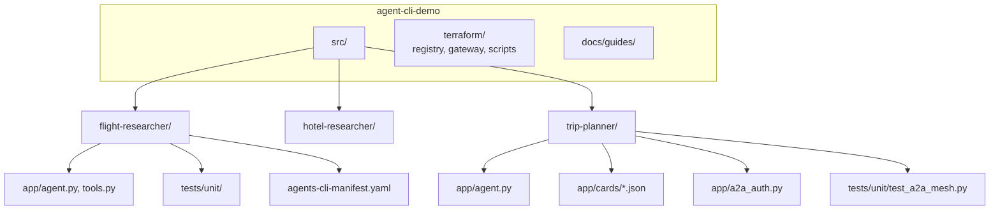
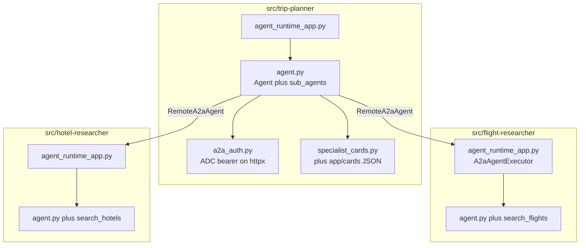
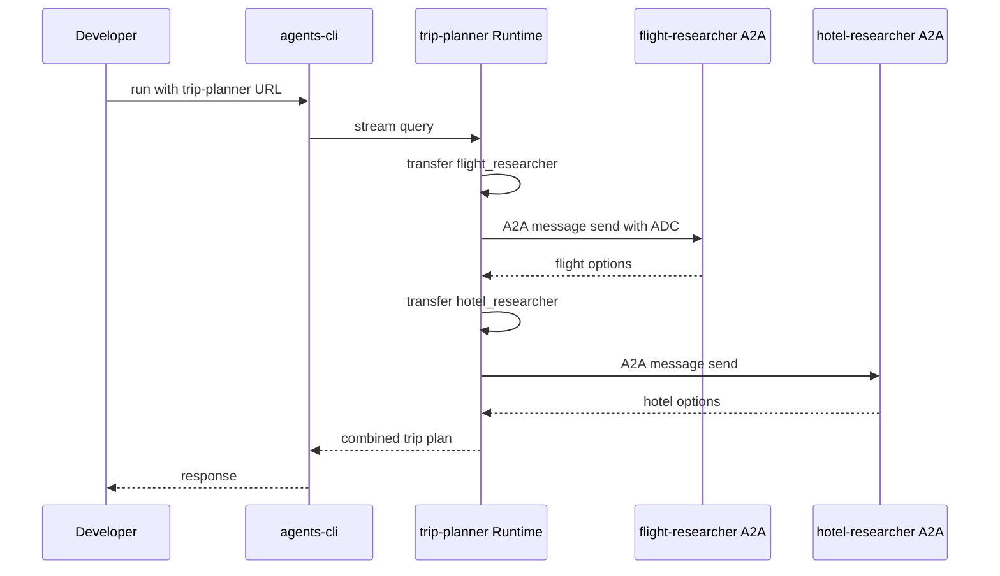
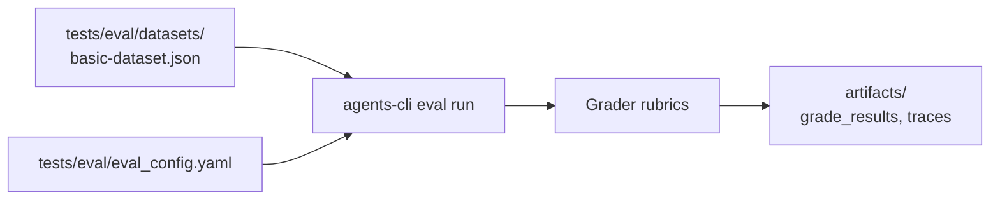
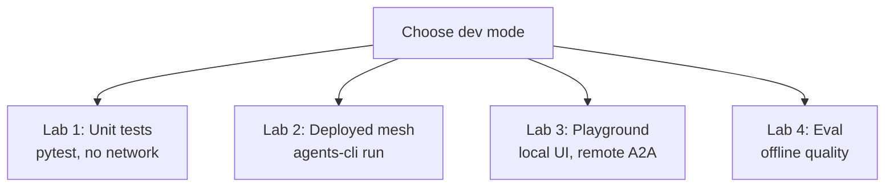
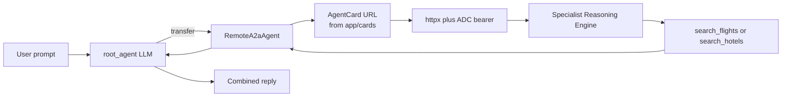

# 01 — Local mesh

Develop and test the trip-planner mesh **before** or **alongside** cloud deploy. This guide walks from a single-agent warm-up to the full three-agent A2A mesh.

**Previous:** [00 — Overview](00-overview.md) | **Next:** [02 — IAM deploy](02-iam-deploy.md)

---

## What you will learn

- How the three agents are laid out in this repo
- How to run **unit tests** per agent package (no monorepo pytest)
- How **`agents-cli install`**, **`run`**, and **`eval`** fit the LLMOps loop
- How **`RemoteA2aAgent`** delegates to deployed specialists
- The difference between local dev modes and platform governance

---

## Concepts

### One agent vs a mesh

| Pattern                | When to use                             | This repo                                                   |
| ---------------------- | --------------------------------------- | ----------------------------------------------------------- |
| **Single agent**       | One LLM + tools, no delegation          | Specialists alone (`flight-researcher`, `hotel-researcher`) |
| **Orchestrator + A2A** | One agent delegates to others over HTTP | `trip-planner` → specialists via `RemoteA2aAgent`           |

A **mesh** here means: one entry agent (trip-planner) that calls specialist agents over **A2A** (`message:send`). Governance (who may call whom) lives on Agent Platform — **not** in Python. There is **no** `mesh_auth` module; `app/a2a_auth.py` only attaches **ADC bearer tokens** to outbound A2A HTTP.

### Repo directory tree

Each agent is a self-contained Agent CLI project. Tests and venvs are **per package** — always `cd src/<agent>` before pytest.



### How to read this diagram — how-to-read-this-diagram-how-t (1)

- **Three siblings under `src/`:** Independent agents — not a shared Python package.
- **`agents-cli-manifest.yaml`:** Tells Agent CLI where app entrypoints and eval config live.
- **`app/cards/` (trip-planner only):** Bundled AgentCard JSON pointing at deployed specialist engine URLs.
- **`terraform/`:** Platform IDs and automation — not imported by agent Python code.
- **Tests path:** Unit tests live inside each agent; root-level pytest will fail on import paths.

### Software architecture



### How to read this diagram — how-to-read-this-diagram-how-t (2)

- **Orchestrator column:** `root_agent` owns two `RemoteA2aAgent` sub-agents — not Python function tools for delegation.
- **`a2a_auth.py`:** Authenticates outbound HTTP to Agent Runtime; distinct from platform IAP persona checks.
- **Bundled cards:** Loaded at startup so each sub-agent knows the specialist A2A URL.
- **Specialist runtimes:** Expose A2A endpoints via `A2aAgentExecutor` when deployed.
- **Solid arrows across columns:** Runtime A2A calls — work against **deployed** engines in the default config.

| Component          | Path                                   | Role                                      |
| ------------------ | -------------------------------------- | ----------------------------------------- |
| Orchestrator       | `trip-planner/app/agent.py`            | Transfers to flight/hotel sub-agents      |
| Outbound HTTP auth | `trip-planner/app/a2a_auth.py`         | ADC bearer tokens on A2A HTTP             |
| Bundled cards      | `trip-planner/app/cards/*.json`        | Specialist AgentCard JSON (deployed URLs) |
| Specialist tools   | `flight-researcher/app/tools.py`, etc. | Mock flight/hotel search                  |

---

## Agent CLI in this repo (prose)

**Install** — From any agent directory, `agents-cli install` reads `pyproject.toml` and runs `uv sync`. That creates or refreshes `.venv` with `google-adk`, test deps, and agent-specific packages. Run install once per agent after clone.

**Run** — `agents-cli run --url <reasoning-engine-url> --mode adk "prompt"` opens a streaming session against a **deployed** engine. The CLI uses your ADC credentials. For trip-planner, the engine orchestrates internally: the LLM transfers to `flight_researcher` and `hotel_researcher`, which issue A2A `message:send` to specialist engines listed in bundled cards.

**Eval** — `agents-cli eval run --region global` loads cases from `tests/eval/datasets/`, invokes the agent logic, grades outputs against rubrics in `tests/eval/eval_config.yaml`, and writes HTML/JSON under `artifacts/`. Eval uses hybrid mock tools where configured so cases run without live A2A — fast regression signal, not a substitute for Lab 2.

---

## Prerequisites

| Requirement                        | How to check                                                          |
| ---------------------------------- | --------------------------------------------------------------------- |
| Python 3.11+                       | `python --version`                                                    |
| [uv](https://docs.astral.sh/uv/)   | `uv --version`                                                        |
| `agents-cli` 0.5.x                 | `agents-cli --version` (install: `uv tool install google-agents-cli`) |
| GCP auth (for eval / deployed run) | `gcloud auth application-default login`                               |

Optional one-time setup:

```bash
uvx google-agents-cli setup
```

---

## Walkthrough

### Lab 0 — Install dependencies (one agent)

Get comfortable with Agent CLI on a **single** specialist before the mesh.

```bash
cd src/flight-researcher
agents-cli install
uv run pytest tests/unit/ -q
```

**What happened:** `agents-cli install` synced the flight-researcher virtualenv. Pytest imported `app/agent.py` and tool helpers entirely on your laptop — no GCP calls.

**Expected output:**

```text
....................                                             [100%]
N passed in X.XXs
```

(Exact test count may vary; exit code **0** is the pass criterion.)

---

### Lab 1 — Unit tests (all three agents, no GCP)

Run tests **per package** — do not run pytest from the repo root.

```bash
cd src/flight-researcher && uv run pytest tests/unit/ -q
cd ../hotel-researcher && uv run pytest tests/unit/ -q
cd ../trip-planner && uv run pytest tests/unit/ -q
```

**What happened:** Each agent's unit suite validated tools, agent wiring, and (for trip-planner) A2A mesh structure. `test_a2a_mesh.py` asserts:

- Two `RemoteA2aAgent` sub-agents named `flight_researcher` and `hotel_researcher`
- Bundled AgentCards validate and reference deployed engine IDs (`8436148099646226432`, `787347082510860288`)

**Expected output:** Three consecutive pytest runs, each ending with `passed` and exit code **0**. Trip-planner output includes at least:

```text
tests/unit/test_a2a_mesh.py ...                                  [100%]
3 passed
```

---

### Lab 2 — Deployed mesh (recommended)

Query the live Agent Runtime orchestrator; A2A delegation hits **deployed** specialists.

```bash
cd src/trip-planner
agents-cli run --url \
  "https://asia-northeast1-aiplatform.googleapis.com/v1beta1/projects/yexperiment/locations/asia-northeast1/reasoningEngines/2464937943706370048" \
  --mode adk \
  "Plan a trip from NYC to San Francisco with flights and hotels."
```

Engine URLs and console links: [`docs/notes/2026-06-21-deploy-endpoints.md`](../notes/2026-06-21-deploy-endpoints.md).



### How to read this diagram — how-to-read-this-diagram-how-t (3)

- **Time flows downward:** Each horizontal arrow is one request/response leg.
- **Developer → CLI:** You only talk to trip-planner's URL — not specialist URLs directly.
- **Transfer steps:** ADK orchestrator chooses sub-agents; each triggers an A2A HTTP call.
- **ADC on A2A:** Outbound calls carry credentials from Application Default Credentials.
- **Combined response:** Orchestrator merges specialist replies into one user-facing answer.

**What happened:** The CLI authenticated with your ADC, streamed a query to trip-planner, and the orchestrator delegated to both specialists over live A2A.

**Expected output:** A natural-language trip plan mentioning **both** flight options (airlines, times, prices) **and** hotel options (names, rates). You should **not** see `a2a_required`, mock-only delegate errors, or a plan with only one section unless the model stopped early (retry once).

**Alternative:** [Console playground](https://console.cloud.google.com/vertex-ai/agents/agent-engines/locations/asia-northeast1/agent-engines/2464937943706370048/playground?project=yexperiment) with the same prompt.

---

### Lab 3 — Local playground (orchestrator only)

Run trip-planner locally for UI iteration. Sub-agents still call **deployed** specialist URLs from bundled cards.

```bash
cd src/trip-planner
agents-cli install
agents-cli playground
```

**What happened:** Agent CLI started a local ADK dev server with hot reload for orchestrator code. Browser UI sends prompts to your laptop; outbound A2A still targets cloud specialist engines from `app/cards/*.json`.

**Expected output:** Terminal prints a local URL (typically `http://127.0.0.1:8000` or similar). Browser shows chat UI. A trip prompt returns flight + hotel content same as Lab 2 (network permitting).

Use this when editing prompts or orchestrator logic — not when testing pure localhost A2A.

---

### Lab 4 — Offline eval (LLMOps baseline)

Eval measures agent quality **before** deploy and tracks regressions over time.

```bash
cd src/trip-planner
agents-cli eval run --region global
```

Baselines and metrics: [`docs/notes/2026-06-21-eval-baseline.md`](../notes/2026-06-21-eval-baseline.md).



### How to read this diagram — how-to-read-this-diagram-how-t (4)

- **Left inputs:** Dataset JSON defines prompts and expected behaviors; YAML configures metrics.
- **`eval run`:** Invokes agent logic (often with mock tools) for each case.
- **Grader:** Scores responses against rubrics — pass/fail or numeric metrics.
- **Artifacts:** HTML and JSON reports for human review and CI comparison.
- **Not shown:** Live A2A — eval validates orchestrator quality, not full mesh networking.

**What happened:** Agent CLI ran each eval case against trip-planner logic, graded responses, and wrote reports under `artifacts/grade_results/` and `artifacts/traces/`.

**Expected output:** Terminal summary with pass rates per metric, ending with exit code **0** on success. Example pattern:

```text
Eval complete: X/Y cases passed
Results: artifacts/grade_results/results_YYYYMMDD_HHMMSS.html
```

Open the HTML file in a browser for per-case detail.

| LLMOps step      | Tool                  | When                              |
| ---------------- | --------------------- | --------------------------------- |
| Baseline eval    | `agents-cli eval run` | After code changes, before deploy |
| Trace inspection | Cloud Trace           | After deploy (guide 02+)          |
| Logging          | Agent Runtime logs    | Production debugging              |

Eval datasets do **not** replace an end-to-end A2A smoke test (Lab 2).

---

### Dev modes (pick your loop)



### How to read this diagram — how-to-read-this-diagram-how-t (5)

- **Four parallel paths:** No strict order after Lab 0 — pick by what you are validating.
- **Unit tests (fastest):** Pure Python, CI-friendly, no ADC required.
- **Deployed mesh (most realistic):** Exercises live A2A + ADC + Reasoning Engines.
- **Playground:** Best for prompt/UI iteration on orchestrator code.
- **Eval:** Best for regression metrics and graded datasets.

> **Note:** Full localhost A2A (three terminals on `:8001`/`:8002`) requires temporarily pointing `app/cards/*.json` at local AgentCard URLs. Bundled cards target deployed engines by design — prefer **Lab 2** for realistic mesh testing.

---

## RemoteA2aAgent call chain (code trace)

When the orchestrator transfers to a sub-agent, ADK resolves the bundled AgentCard URL and sends A2A HTTP.



### How to read this diagram — how-to-read-this-diagram-how-t (6)

- **LLM decides:** `root_agent` instruction tells the model to transfer — not hard-coded routing.
- **RemoteA2aAgent:** ADK class wrapping A2A client behavior.
- **AgentCard URL:** JSON file ships with deploy; points at `.../reasoningEngines/<id>/a2a`.
- **ADC bearer:** `create_authenticated_httpx_client()` in `a2a_auth.py`.
- **Return path:** Specialist tool output flows back through the same chain to the user.

Relevant code:

```36:56:src/trip-planner/app/agent.py
flight_researcher = RemoteA2aAgent(
    name="flight_researcher",
    ...
    agent_card=flight_agent_card(),
    httpx_client=_a2a_http_client,
    use_legacy=False,
)

hotel_researcher = RemoteA2aAgent(
    name="hotel_researcher",
    ...
    agent_card=hotel_agent_card(),
    httpx_client=_a2a_http_client,
    use_legacy=False,
)
```

---

## Verify

Run this checklist before moving to deploy:

```bash
# 1. All unit tests green (per package)
cd src/trip-planner && uv run pytest tests/unit/ -q

# 2. Orchestrator has two A2A sub-agents
uv run pytest tests/unit/test_a2a_mesh.py -q

# 3. (Optional) Live mesh — expect flight + hotel sections in response
agents-cli run --url \
  "https://asia-northeast1-aiplatform.googleapis.com/v1beta1/projects/yexperiment/locations/asia-northeast1/reasoningEngines/2464937943706370048" \
  --mode adk \
  "Plan NYC to SFO with flights and hotels."
```

| Check              | Pass criteria                                                                      |
| ------------------ | ---------------------------------------------------------------------------------- |
| Unit tests         | Exit code 0 from each `src/<agent>` package                                        |
| `test_a2a_mesh.py` | Sub-agent names and bundled card engine IDs match deploy note                      |
| Live run           | Response mentions both flights and hotels (not `a2a_required` or mock-only errors) |

---

## Troubleshooting

| Symptom                                | Likely cause                          | Fix                                                                               |
| -------------------------------------- | ------------------------------------- | --------------------------------------------------------------------------------- |
| `a2a_required` or mock delegate errors | Old orchestrator code or stale deploy | Redeploy trip-planner; confirm `RemoteA2aAgent` in `agent.py`                     |
| 401 on A2A delegation                  | Wrong runtime identity                | Orchestrator must use `trip-planner-sa`; see [02-iam-deploy.md](02-iam-deploy.md) |
| Only flights, no hotels                | Model stopped early                   | Retry prompt; check orchestrator instruction in `agent.py`                        |
| `agents-cli: command not found`        | CLI not installed                     | `uv tool install google-agents-cli`                                               |
| Eval fails auth                        | Missing ADC                           | `gcloud auth application-default login`                                           |
| Import errors in tests                 | Venv not synced                       | `agents-cli install` in that agent directory                                      |
| pytest import errors at repo root      | Wrong working directory               | Always `cd src/<agent>` before pytest                                             |

---

## Further reading

- [00 — Overview](00-overview.md) — glossary, platform layers, syllabus
- A2A refactor notes: [`docs/notes/2026-06-21-a2a-mesh-refactor.md`](../notes/2026-06-21-a2a-mesh-refactor.md)
- Eval baselines: [`docs/notes/2026-06-21-eval-baseline.md`](../notes/2026-06-21-eval-baseline.md)

---

## Next step

Deploy privately to Agent Runtime: **[02 — IAM deploy](02-iam-deploy.md)**.
