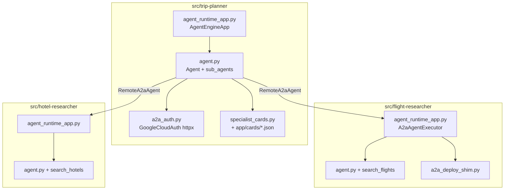
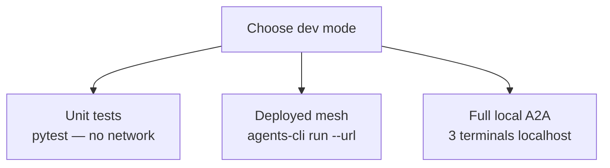
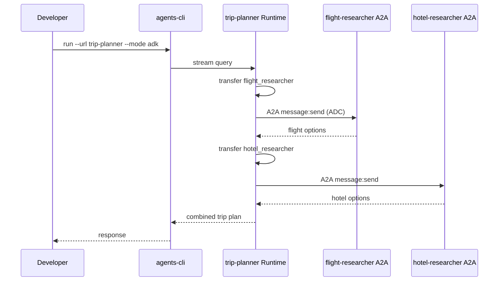
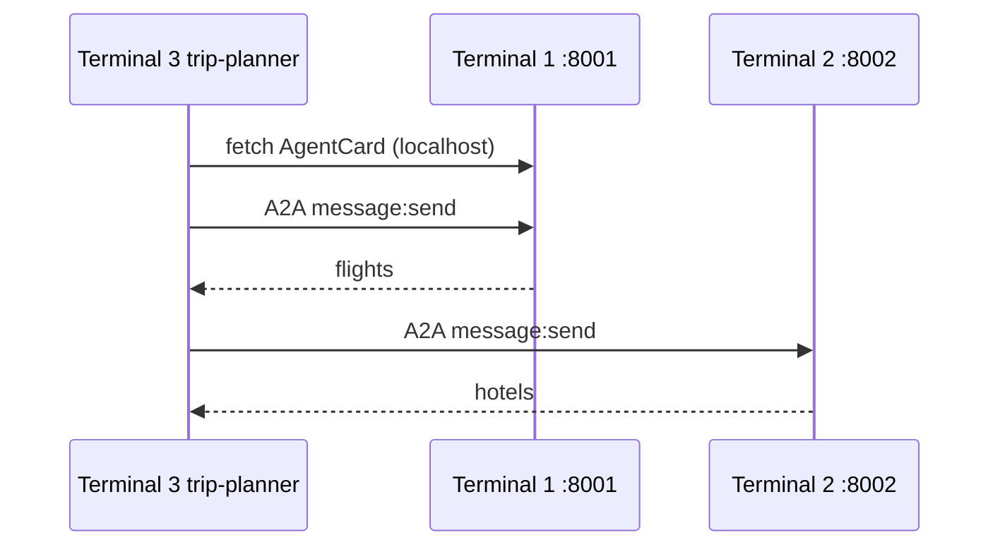

# 01 — Local mesh

Develop and test the trip-planner mesh before or alongside platform deploy. This guide covers **software architecture**, **local dev modes**, and **offline eval**.

## Prerequisites

- `agents-cli` 0.5.x (`uv tool install google-agents-cli`)
- Python 3.11+
- GCP auth for Vertex eval (optional for unit tests)

## Software architecture

Each agent is an ADK **`App`** with a **`root_agent`**. Trip-planner adds **`RemoteA2aAgent`** sub-agents; specialists expose tools only (no orchestration).



| Component        | Location                                                          | Role                                                  |
| ---------------- | ----------------------------------------------------------------- | ----------------------------------------------------- |
| Orchestrator     | `trip-planner/app/agent.py`                                       | Transfers to `flight_researcher` / `hotel_researcher` |
| Outbound auth    | `trip-planner/app/a2a_auth.py`                                    | ADC bearer tokens on A2A HTTP                         |
| Bundled cards    | `trip-planner/app/cards/`                                         | Specialist AgentCard JSON (no deploy env URLs)        |
| Specialist tools | `flight-researcher/app/tools.py`, `hotel-researcher/app/tools.py` | Mock flight/hotel search                              |

Governance is **not** implemented in Python—see [04-mesh-governance.md](04-mesh-governance.md).

## Unit tests (no GCP)

```bash
cd src/flight-researcher && uv run pytest tests/unit/ -q
cd src/hotel-researcher && uv run pytest tests/unit/ -q
cd src/trip-planner && uv run pytest tests/unit/ -q
```

Orchestration wiring: `src/trip-planner/tests/unit/test_a2a_mesh.py`.

## Dev modes

Three ways to exercise the mesh locally:



### Mode A — Deployed mesh (recommended)

Query the live Agent Runtime orchestrator; A2A delegation hits deployed specialists.

```bash
cd src/trip-planner
agents-cli run --url <trip-planner-engine-url> --mode adk \
  "Plan a trip from NYC to San Francisco with flights and hotels."
```

Engine URLs: [`docs/notes/2026-06-21-deploy-endpoints.md`](../notes/2026-06-21-deploy-endpoints.md).



### Mode B — Full local A2A (three terminals)

Run specialists as local A2A servers; override bundled cards with localhost URLs (**development only**).

```bash
# Terminal 1 — flight
cd src/flight-researcher && agents-cli install && agents-cli run --agent adk_a2a --port 8001

# Terminal 2 — hotel
cd src/hotel-researcher && agents-cli install && agents-cli run --agent adk_a2a --port 8002

# Terminal 3 — orchestrator
export FLIGHT_A2A_CARD_URL=http://127.0.0.1:8001/.well-known/agent.json
export HOTEL_A2A_CARD_URL=http://127.0.0.1:8002/.well-known/agent.json
cd src/trip-planner && agents-cli install && agents-cli run "Plan NYC to SFO."
```



## Eval

Offline eval against the orchestrator (no live A2A required for baseline datasets):

```bash
cd src/trip-planner
agents-cli eval run --region global
```

Baselines: [`docs/notes/2026-06-21-eval-baseline.md`](../notes/2026-06-21-eval-baseline.md).

## Next steps

- Private deploy: [02-iam-deploy.md](02-iam-deploy.md)
- Ingress paths: [03-auth-gateway.md](03-auth-gateway.md)
