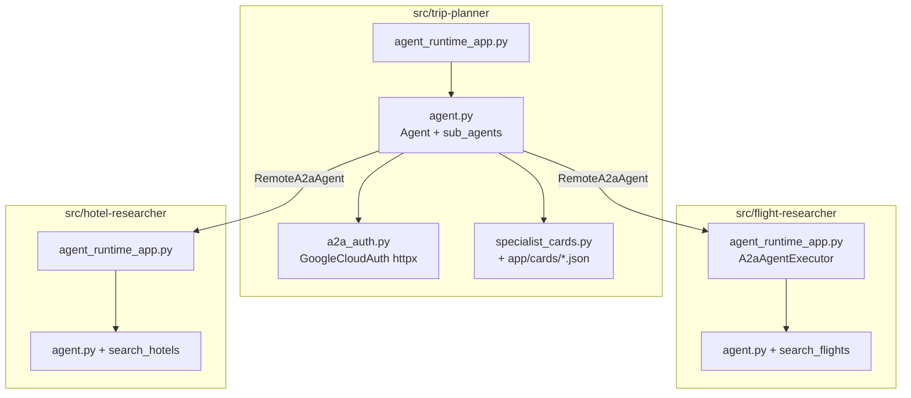
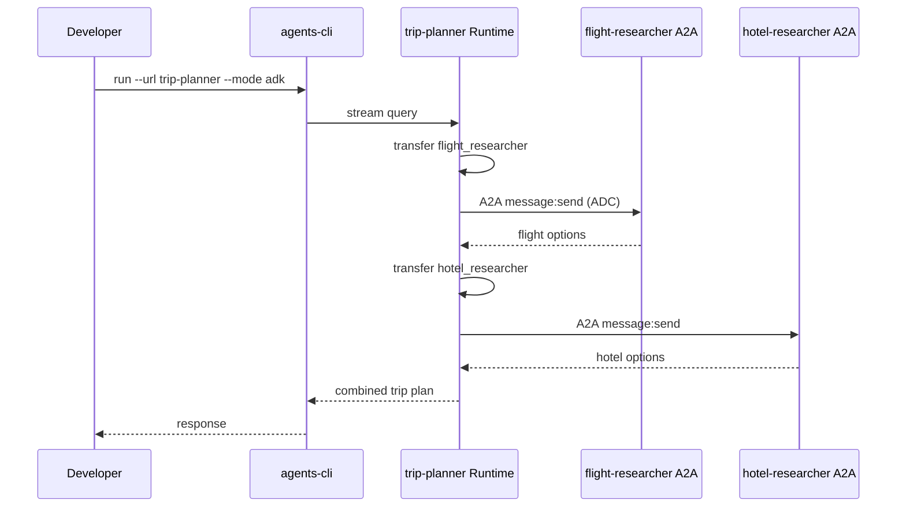
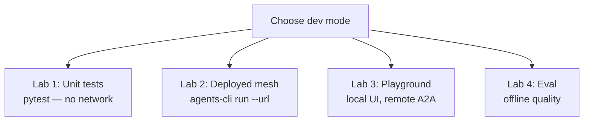

# 01 — Local mesh

Develop and test the trip-planner mesh **before** or **alongside** cloud deploy. This guide walks from a single-agent warm-up to the full three-agent A2A mesh.

**Previous:** [00 — Overview](00-overview.md) | **Next:** [02 — IAM deploy](02-iam-deploy.md)

---

## What you will learn

- How the three agents are laid out in this repo
- How to run **unit tests** without GCP
- How to query the **deployed** orchestrator with `agents-cli run`
- How **offline eval** fits into LLMOps
- The difference between local dev and platform governance

---

## Concepts

### One agent vs a mesh

| Pattern                | When to use                             | This repo                                                   |
| ---------------------- | --------------------------------------- | ----------------------------------------------------------- |
| **Single agent**       | One LLM + tools, no delegation          | Specialists alone (`flight-researcher`, `hotel-researcher`) |
| **Orchestrator + A2A** | One agent delegates to others over HTTP | `trip-planner` → specialists via `RemoteA2aAgent`           |

A **mesh** here means: one entry agent (trip-planner) that calls specialist agents over **A2A** (`message:send`). Governance (who may call whom) lives on Agent Platform—not in Python.

### Software architecture



| Component        | Path                                   | Role                                      |
| ---------------- | -------------------------------------- | ----------------------------------------- |
| Orchestrator     | `trip-planner/app/agent.py`            | Transfers to flight/hotel sub-agents      |
| Outbound auth    | `trip-planner/app/a2a_auth.py`         | ADC bearer tokens on A2A HTTP             |
| Bundled cards    | `trip-planner/app/cards/*.json`        | Specialist AgentCard JSON (deployed URLs) |
| Specialist tools | `flight-researcher/app/tools.py`, etc. | Mock flight/hotel search                  |

---

## Prerequisites

| Requirement                        | How to check                                                          |
| ---------------------------------- | --------------------------------------------------------------------- |
| Python 3.11+                       | `python --version`                                                    |
| [uv](https://docs.astral.sh/uv/)   | `uv --version`                                                        |
| `agents-cli` 0.5.x                 | `agents-cli --version` (install: `uv tool install google-agents-cli`) |
| GCP auth (for eval / deployed run) | `gcloud auth application-default login`                               |

Optional one-time setup:

```bash
uvx google-agents-cli setup
```

---

## Walkthrough

### Lab 0 — Install dependencies (one agent)

Get comfortable with Agent CLI on a **single** specialist before the mesh.

```bash
cd src/flight-researcher
agents-cli install
uv run pytest tests/unit/ -q
```

**What happened:** `agents-cli install` runs `uv sync` for that agent's venv. Unit tests exercise tools and agent wiring without network calls.

### Lab 1 — Unit tests (all three agents, no GCP)

```bash
cd src/flight-researcher && uv run pytest tests/unit/ -q
cd ../hotel-researcher && uv run pytest tests/unit/ -q
cd ../trip-planner && uv run pytest tests/unit/ -q
```

Orchestration wiring is asserted in `src/trip-planner/tests/unit/test_a2a_mesh.py`:

- Two `RemoteA2aAgent` sub-agents named `flight_researcher` and `hotel_researcher`
- Bundled AgentCards validate and reference deployed engine IDs

### Lab 2 — Deployed mesh (recommended)

Query the live Agent Runtime orchestrator; A2A delegation hits **deployed** specialists.

```bash
cd src/trip-planner
agents-cli run --url \
  "https://asia-northeast1-aiplatform.googleapis.com/v1beta1/projects/yexperiment/locations/asia-northeast1/reasoningEngines/2464937943706370048" \
  --mode adk \
  "Plan a trip from NYC to San Francisco with flights and hotels."
```

Engine URLs and console links: [`docs/notes/2026-06-21-deploy-endpoints.md`](../notes/2026-06-21-deploy-endpoints.md).



**Alternative:** Use the [Console playground](https://console.cloud.google.com/vertex-ai/agents/agent-engines/locations/asia-northeast1/agent-engines/2464937943706370048/playground?project=yexperiment) with the same prompt.

### Lab 3 — Local playground (orchestrator only, no A2A)

Run trip-planner locally for UI iteration. Sub-agents still call **deployed** specialist URLs from bundled cards.

```bash
cd src/trip-planner
agents-cli install
agents-cli playground
```

Use this when editing prompts or orchestrator logic—not when testing pure localhost A2A.

### Lab 4 — Offline eval (LLMOps baseline)

Eval measures agent quality **before** deploy and tracks regressions over time.

```bash
cd src/trip-planner
agents-cli eval run --region global
```

Baselines and metrics: [`docs/notes/2026-06-21-eval-baseline.md`](../notes/2026-06-21-eval-baseline.md).

| LLMOps step      | Tool                  | When                                                                                                       |
| ---------------- | --------------------- | ---------------------------------------------------------------------------------------------------------- |
| Baseline eval    | `agents-cli eval run` | After code changes, before deploy                                                                          |
| Trace inspection | Cloud Trace           | After deploy ([observability guide](https://google.github.io/agents-cli/guide/observability/cloud-trace/)) |
| Logging          | Agent Runtime logs    | Production debugging                                                                                       |

Eval datasets run against the orchestrator logic; they do **not** replace an end-to-end A2A smoke test (Lab 2).

### Dev modes (summary)



> **Note:** Full localhost A2A (three terminals on `:8001`/`:8002`) requires temporarily pointing `app/cards/*.json` at local AgentCard URLs. Bundled cards target deployed engines by design—prefer **Lab 2** for realistic mesh testing.

---

## Verify

Run this checklist before moving to deploy:

```bash
# 1. All unit tests green
cd src/trip-planner && uv run pytest tests/unit/ -q

# 2. Orchestrator has two A2A sub-agents
uv run pytest tests/unit/test_a2a_mesh.py -q

# 3. (Optional) Live mesh — expect flight + hotel sections in response
cd src/trip-planner
agents-cli run --url "<trip-planner-engine-url>" --mode adk \
  "Plan NYC to SFO with flights and hotels."
```

| Check              | Pass criteria                                                                      |
| ------------------ | ---------------------------------------------------------------------------------- |
| Unit tests         | Exit code 0                                                                        |
| `test_a2a_mesh.py` | Sub-agent names and bundled card IDs match deploy note                             |
| Live run           | Response mentions both flights and hotels (not `a2a_required` or mock-only errors) |

---

## Troubleshooting

| Symptom                                | Likely cause                          | Fix                                                                               |
| -------------------------------------- | ------------------------------------- | --------------------------------------------------------------------------------- |
| `a2a_required` or mock delegate errors | Old orchestrator code or stale deploy | Redeploy trip-planner; confirm `RemoteA2aAgent` in `agent.py`                     |
| 401 on A2A delegation                  | Wrong runtime identity                | Orchestrator must use `trip-planner-sa`; see [02-iam-deploy.md](02-iam-deploy.md) |
| Only flights, no hotels                | Model stopped early                   | Retry prompt; check orchestrator instruction in `agent.py`                        |
| `agents-cli: command not found`        | CLI not installed                     | `uv tool install google-agents-cli`                                               |
| Eval fails auth                        | Missing ADC                           | `gcloud auth application-default login`                                           |
| Import errors in tests                 | Venv not synced                       | `agents-cli install` in that agent directory                                      |

---

## Further reading

- [Agent CLI — Development](https://google.github.io/agents-cli/guide/development/)
- [Agent CLI — Evaluation](https://google.github.io/agents-cli/guide/evaluation/)
- [Agent CLI — Project structure](https://google.github.io/agents-cli/guide/project-structure/)
- [ADK Remote A2aAgent](https://google.github.io/adk-docs/) (orchestration pattern)
- A2A refactor notes: [`docs/notes/2026-06-21-a2a-mesh-refactor.md`](../notes/2026-06-21-a2a-mesh-refactor.md)

---

## Next step

Deploy privately to Agent Runtime: **[02 — IAM deploy](02-iam-deploy.md)**.
