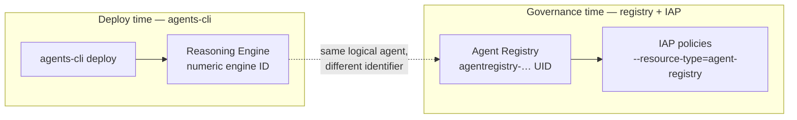
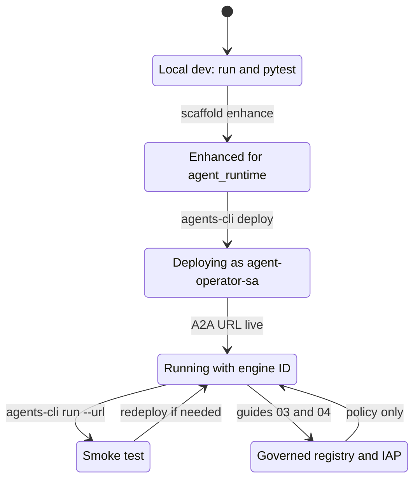
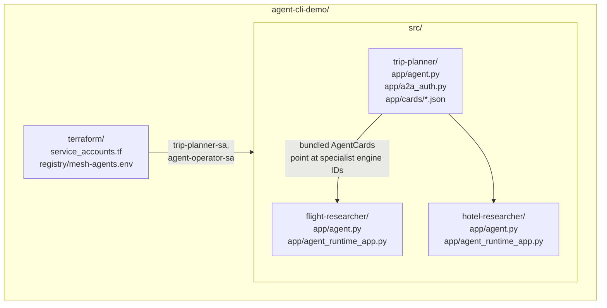
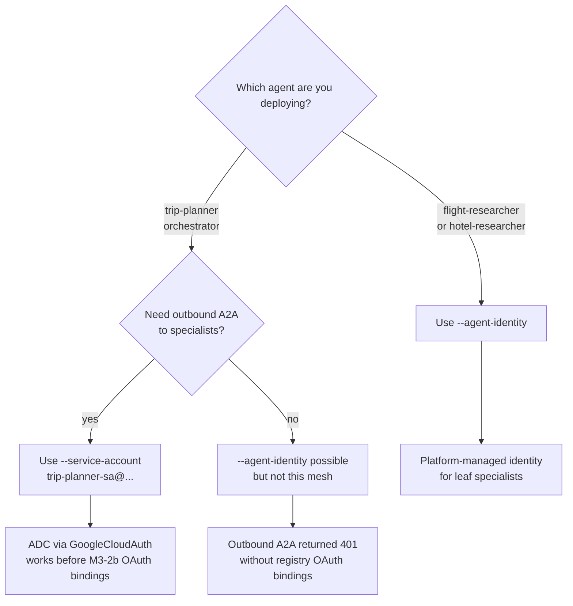
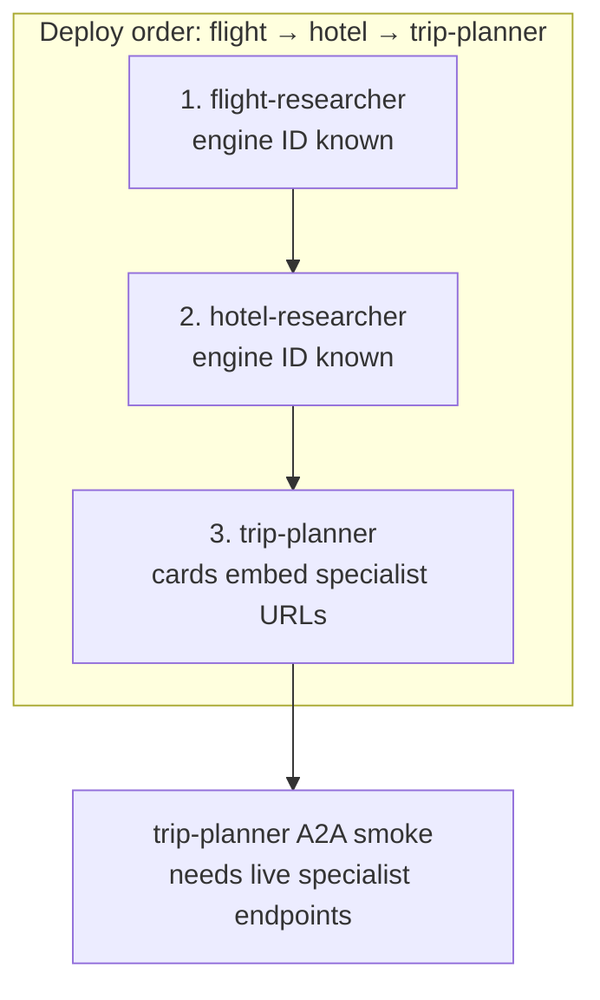
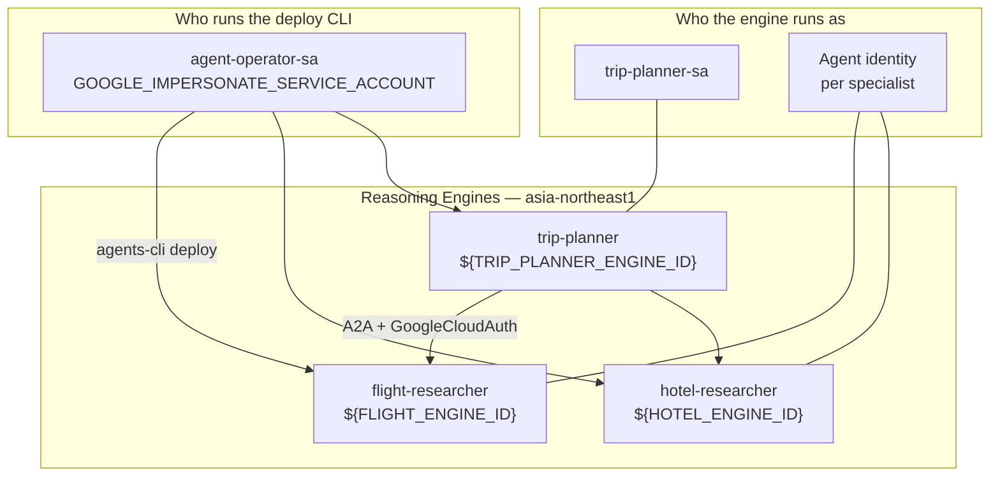
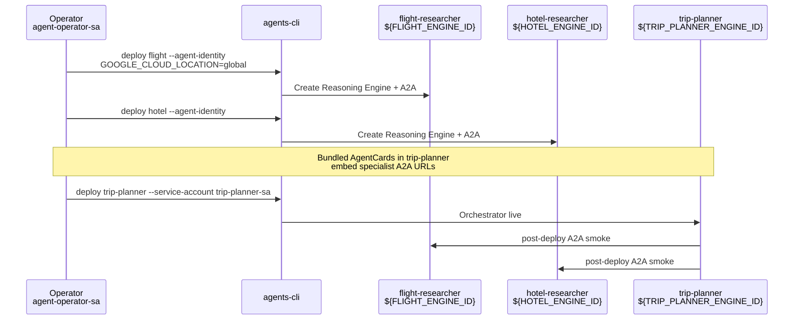

# 02 — Private IAM deploy

Deploy the three-agent trip-planner mesh to **Agent Runtime** in `<your-gcp-project>` / `asia-northeast1`. This guide uses a **diagram-first** layout with short micro-tutorials so you can see the whole system before running commands.

**Previous:** [01 — Local mesh](01-local-mesh.md) | **Next:** [03 — Auth gateway](03-auth-gateway.md)

---

## What you will learn

- How a deployed agent becomes a **Reasoning Engine** with a numeric **engine ID**
- How **Reasoning Engine ID**, **Registry agent UID**, and **engine ID in URLs** differ—and when to use each
- Why deploy order is **leaf-first** (flight → hotel → trip-planner)
- Why specialists use **`--agent-identity`** but trip-planner uses **`trip-planner-sa`**
- How **`agent-operator-sa` impersonation** lets you deploy without using your personal user identity
- How to smoke-test A2A after deploy

---

## Concepts (In plain English)

### Three IDs you will see everywhere

Junior engineers often mix these up. They are **different objects** for **different APIs**.

| Name                   | Example in this repo                                 | Plain English                                               | When you need it                                               |
| ---------------------- | ---------------------------------------------------- | ----------------------------------------------------------- | -------------------------------------------------------------- |
| **Reasoning Engine**   | A live runtime container for one ADK app             | “The deployed agent instance on Agent Platform.”            | Console playground, Cloud Trace, understanding what is running |
| **Engine ID**          | `${TRIP_PLANNER_ENGINE_ID}` (trip-planner)           | The **numeric ID** Google assigns to that Reasoning Engine. | `agents-cli run --url`, A2A URLs, updating bundled AgentCards  |
| **Registry agent UID** | `agentregistry-00000000-0000-0000-951b-1e5d969e3b7b` | A **governance catalog entry** for the same logical agent.  | IAP policies, ingress bindings, registry services—not deploy   |

**Rule of thumb:** Deploy and debug runtime with **engine IDs**. Govern access with **registry UIDs** from [`terraform/registry/mesh-agents.env`](../../terraform/registry/mesh-agents.env.example). Guide [04 — Mesh governance](04-mesh-governance.md) covers registry and IAP.



### How to read this diagram — how-to-read-this-diagram-how-t (1)

- **Left side** is what `agents-cli deploy` creates: a Reasoning Engine you query and trace.
- **Right side** is the governance layer; it does not replace deploy—it **references** the same agent under a registry UID.
- The dashed line means “same trip-planner in the lab,” not “same string ID.”
- IAP commands always take the **registry UID**, never the numeric engine ID.
- If a smoke test uses an engine URL but IAP fails, check you did not paste an engine ID into an IAP `--agent=` flag.

### Reasoning Engine lifecycle

From your laptop to a callable private endpoint:



### How to read this diagram — how-to-read-this-diagram-how-t (2)

- **LocalDev** is guide [01 — Local mesh](01-local-mesh.md); no Reasoning Engine exists yet in GCP.
- **Enhanced** adds Agent Runtime packaging (`agent_runtime_app.py`, deploy metadata)—do this once per agent.
- **Deploying** is the focus of this guide; impersonation runs as `agent-operator-sa`, not your user account.
- **Running** means you have stable engine IDs and A2A endpoints; record them in bundled cards if they change.
- **Governed** is optional for raw A2A smoke but required before persona tests and production ingress.

### Repo directory tree (deploy-relevant paths)

You do not need every file—know **where deploy inputs live**:



### How to read this diagram — how-to-read-this-diagram-how-t (3)

- **`terraform/`** creates service accounts; apply Terraform before first deploy.
- Each agent under **`src/`** is an independent Python package with its own venv (`agents-cli install`).
- **`trip-planner/app/cards/`** embeds specialist A2A URLs—update after specialist redeploys change engine IDs.
- **`a2a_auth.py`** attaches ADC bearer tokens for outbound A2A from trip-planner.
- Specialists may include **`a2a_deploy_shim.py`** to work around AgentCard protobuf quirks at deploy time.

### Identity decision tree: trip-planner-sa vs agent-identity

Agent Platform assigns a **runtime identity** to each Reasoning Engine. That identity is what downstream IAP and A2A see as “who is calling.”



### How to read this diagram — how-to-read-this-diagram-how-t (4)

- **Leaf specialists** (flight, hotel) take **`--agent-identity`**: Google issues a platform agent identity automatically.
- **trip-planner** is the only agent that **calls other agents**; it uses **`trip-planner-sa`** so `GoogleCloudAuth` in `a2a_auth.py` can obtain tokens via ADC.
- **`--agent-identity` on trip-planner** failed with **401** on outbound A2A until registry OAuth bindings exist (M3-2b)—documented in [`docs/archive/yexperiment-poc/2026-06-21-a2a-mesh-refactor.md`](../archive/yexperiment-poc/2026-06-21-a2a-mesh-refactor.md).
- You **cannot** flip identity mode on an existing engine in one update; recreate trip-planner if you must switch.
- **Deploy** still runs as **`agent-operator-sa`** (impersonation)—that is separate from **runtime** identity.

### Live engine IDs and runtime identity (reference)

| Agent             | Engine ID                   | Deploy flag                             | Runtime caller identity |
| ----------------- | --------------------------- | --------------------------------------- | ----------------------- |
| flight-researcher | `${FLIGHT_ENGINE_ID}`       | `--agent-identity`                      | Platform agent identity |
| hotel-researcher  | `${HOTEL_ENGINE_ID}`        | `--agent-identity`                      | Platform agent identity |
| trip-planner      | `${TRIP_PLANNER_ENGINE_ID}` | `--service-account trip-planner-sa@...` | `trip-planner-sa`       |

Registry UID for trip-planner (governance, not deploy): `TRIP_PLANNER_REGISTRY_AGENT=agentregistry-00000000-0000-0000-951b-1e5d969e3b7b` in [`mesh-agents.env`](../../terraform/registry/mesh-agents.env.example).

### Why leaf-first deploy order?



### How to read this diagram — how-to-read-this-diagram-how-t (5)

- **Specialists first** because trip-planner’s bundled AgentCards reference their **A2A URLs** (which include specialist engine IDs).
- If you deploy trip-planner before specialists, cards point at missing or stale engines—smoke tests fail with connection or 404 errors.
- If you **redeploy a specialist** and its engine ID changes, **redeploy trip-planner** after updating `app/cards/*.json`.
- Order is always **flight → hotel → trip-planner**, not parallel orchestrator-first.
- Terraform and registry setup can happen in parallel, but **runtime A2A** assumes specialists exist first.

### Deploy topology (operator → engines → A2A)



### How to read this diagram — how-to-read-this-diagram-how-t (6)

- **Top box** is deploy-time impersonation only; it does not appear in A2A traces as the caller.
- **Runtime identity** boxes show what the platform uses when the engine handles requests.
- **Arrows from trip-planner** are outbound A2A; they require `GOOGLE_CLOUD_LOCATION=global` for `gemini-3.1-flash-lite`.
- All three engines live in **`asia-northeast1`** even when the model location is **`global`**.
- Gateways (`mesh-egress-gateway`, `mesh-ingress-gateway`) exist in the project but OAuth persona tests may still be pending—see [05 — Gateway policy demo](05-gateway-policy-demo.md).

---

## Prerequisites

| Requirement                     | Notes                                                             |
| ------------------------------- | ----------------------------------------------------------------- |
| Guide 01 complete (recommended) | Local tests pass; you understand `RemoteA2aAgent`                 |
| Terraform applied               | Service accounts — [`terraform/main.tf`](../../terraform/main.tf) |
| `agents-cli` + per-agent venvs  | `agents-cli install` in each `src/*` directory                    |
| ADC                             | `gcloud auth application-default login`                           |
| Operator impersonation          | Deploy uses **`agent-operator-sa`**, not your user SA             |

```bash
export GOOGLE_IMPERSONATE_SERVICE_ACCOUNT=agent-operator-sa@<your-gcp-project>.iam.gserviceaccount.com
export GOOGLE_CLOUD_PROJECT=<your-gcp-project>
export GOOGLE_CLOUD_LOCATION=asia-northeast1
```

---

## Walkthrough

Each lab is a **micro-tutorial**: a short goal, commands, and what to notice.

### Micro-tutorial A — Enhance for Agent Runtime (once per agent)

**Goal:** Add Agent Runtime packaging so `agents-cli deploy` knows how to start your ADK app.

If not already enhanced:

```bash
cd src/flight-researcher
agents-cli scaffold enhance . --deployment-target agent_runtime --region asia-northeast1 -y --skip-checks

cd ../hotel-researcher
agents-cli scaffold enhance . --deployment-target agent_runtime --region asia-northeast1 -y --skip-checks

cd ../trip-planner
agents-cli scaffold enhance . --deployment-target agent_runtime --region asia-northeast1 -y --skip-checks
```

**Notice:** Each agent keeps its own `pyproject.toml` and venv. Enhancement is idempotent—you can re-run safely.

### Micro-tutorial B — Deploy flight-researcher (leaf, agent identity)

**Goal:** Create the first Reasoning Engine; record its engine ID.

```bash
cd src/flight-researcher
agents-cli deploy --project <your-gcp-project> --region asia-northeast1 \
  --agent-identity --no-confirm-project \
  --update-env-vars "GOOGLE_CLOUD_LOCATION=global"
```

**Why `GOOGLE_CLOUD_LOCATION=global`:** `gemini-3.1-flash-lite` is not available in every regional endpoint; **`global`** is required for this model on all three agents.

**Notice:** `--agent-identity` means you do **not** pass `--service-account` for specialists.

### Micro-tutorial C — Deploy hotel-researcher (second leaf)

**Goal:** Second specialist live before orchestrator.

```bash
cd ../hotel-researcher
agents-cli deploy --project <your-gcp-project> --region asia-northeast1 \
  --agent-identity --no-confirm-project \
  --update-env-vars "GOOGLE_CLOUD_LOCATION=global"
```

**Notice:** Deploy order **flight → hotel** is intentional; hotel does not depend on flight, but both must exist before trip-planner.

### Micro-tutorial D — Deploy trip-planner (orchestrator, service account)

**Goal:** Orchestrator runs as `trip-planner-sa` and calls specialists via bundled cards.

```bash
cd ../trip-planner
agents-cli deploy --project <your-gcp-project> --region asia-northeast1 \
  --service-account trip-planner-sa@<your-gcp-project>.iam.gserviceaccount.com \
  --no-confirm-project \
  --update-env-vars "GOOGLE_CLOUD_LOCATION=global"
```

**If engine IDs changed:** Update `app/cards/flight-researcher-agent-card.json` and `app/cards/hotel-researcher-agent-card.json`, then redeploy trip-planner.



### How to read this diagram — how-to-read-this-diagram-how-t (7)

- **Operator** uses impersonation; the sequence shows CLI actions, not end-user OAuth.
- **Steps 1–2** must complete before step 3 so card URLs target real engines.
- **`GOOGLE_CLOUD_LOCATION=global`** is set on every deploy in this mesh for the shared model.
- **Post-deploy smoke** is trip-planner calling specialists—the first proof of leaf-first ordering.
- If smoke fails with **401**, confirm trip-planner used **`trip-planner-sa`**, not `--agent-identity`.

### Micro-tutorial D2 — Discover mesh IDs (after deploy)

**Goal:** Write project-specific engine IDs, registry UIDs, and card URLs to local config (not committed).

```bash
export GOOGLE_CLOUD_PROJECT=<your-gcp-project>
cp terraform/terraform.tfvars.example terraform/terraform.tfvars   # set project_id
./terraform/scripts/discover_mesh.sh
```

This creates `terraform/registry/mesh-agents.env`, resolves IAP policy templates, and patches specialist AgentCard URLs. Governance scripts ([`apply_mesh_governance.sh`](../../terraform/scripts/apply_mesh_governance.sh), [`setup_agent_gateway.sh`](../../terraform/scripts/setup_agent_gateway.sh)) require this file.

### Micro-tutorial E — AgentCard deploy shim (specialists only)

**Symptom:** Deploy fails with `'AgentCard' object has no attribute 'DESCRIPTOR'`.

**Fix:** Ensure `app/app_utils/a2a_deploy_shim.py` is wired in `agent_runtime_app.py` (already present in this repo for both specialists).

---

## Verify

### Smoke test (end-to-end A2A)

```bash
cd src/trip-planner
agents-cli run --url \
  "https://asia-northeast1-aiplatform.googleapis.com/v1beta1/projects/<your-gcp-project>/locations/asia-northeast1/reasoningEngines/${TRIP_PLANNER_ENGINE_ID}" \
  --mode adk \
  "Plan NYC to SFO with flights and hotels."
```

| Check                  | Pass criteria                                                                                                                                                                                            |
| ---------------------- | -------------------------------------------------------------------------------------------------------------------------------------------------------------------------------------------------------- |
| Console playground     | [trip-planner playground](https://console.cloud.google.com/vertex-ai/agents/agent-engines/locations/asia-northeast1/agent-engines/${TRIP_PLANNER_ENGINE_ID}/playground?project=<your-gcp-project>) loads |
| Smoke run              | Response mentions both flights and hotels                                                                                                                                                                |
| Engine IDs in env file | Match live engines in [`mesh-agents.env`](../../terraform/registry/mesh-agents.env.example)                                                                                                              |
| Cloud Trace            | Spans show trip-planner → specialist A2A delegation                                                                                                                                                      |

```bash
# Optional: deploy status if you used --no-wait
agents-cli deploy --status
```

**Private access:** No public anonymous endpoints. Programmatic callers use IAM tokens ([03 — Auth gateway](03-auth-gateway.md)). Human OAuth via Agent Gateway is configured in [05 — Gateway policy demo](05-gateway-policy-demo.md); gateways exist but full persona tests may still be pending.

---

## Teardown

Reverse deploy order to avoid dependency errors. Script: [`terraform/scripts/teardown_mesh.sh`](../../terraform/scripts/teardown_mesh.sh).

```bash
# Preview (default — no mutations)
./terraform/scripts/teardown_mesh.sh --dry-run

# Execute full mesh teardown
./terraform/scripts/teardown_mesh.sh --confirm <your-gcp-project>

# Optional: delete orphan Reasoning Engines not listed in mesh-agents.env
./terraform/scripts/teardown_mesh.sh --confirm <your-gcp-project> --include-orphans

# Optional: skip root terraform destroy if local state is missing
./terraform/scripts/teardown_mesh.sh --confirm <your-gcp-project> --skip-terraform
```

| Phase | Deletes                                           |
| ----- | ------------------------------------------------- |
| 1     | Reasoning Engines (trip-planner → hotel → flight) |
| 2     | IAP policies on registry agents                   |
| 3     | Registry bindings, services, agents               |
| 4     | Authz extension + Agent Gateways                  |
| 5     | OAuth connector (if created)                      |
| 6     | Root Terraform SAs + IAM (`terraform destroy`)    |

**Not deleted:** GCP project, enabled APIs, OAuth client in Console, Cloud Logging history.

After teardown, [`check_mesh_gateway_status.sh`](../../terraform/scripts/check_mesh_gateway_status.sh) should **exit 1** (expected).

---

## Troubleshooting

| Symptom                               | Likely cause                                              | Fix                                                                                                      |
| ------------------------------------- | --------------------------------------------------------- | -------------------------------------------------------------------------------------------------------- |
| Deploy permission denied              | Missing impersonation                                     | `export GOOGLE_IMPERSONATE_SERVICE_ACCOUNT=agent-operator-sa@<your-gcp-project>.iam.gserviceaccount.com` |
| Model not found in region             | Regional model gap                                        | Set `GOOGLE_CLOUD_LOCATION=global` on deploy                                                             |
| 401 on outbound A2A                   | trip-planner on `--agent-identity` without OAuth bindings | Redeploy with `--service-account trip-planner-sa@...`                                                    |
| Cannot switch identity on same engine | Platform constraint                                       | Delete and recreate trip-planner Reasoning Engine                                                        |
| AgentCard DESCRIPTOR error            | Pydantic/protobuf mismatch                                | Use `a2a_deploy_shim.py` on specialists                                                                  |
| Stale specialist content in plan      | Engine IDs changed                                        | Update `app/cards/*.json`, redeploy trip-planner                                                         |
| Used engine ID in IAP command         | Wrong identifier type                                     | Use registry UID from `mesh-agents.env` with `--resource-type=agent-registry` (guide 04)                 |
| `mesh-agents.env` smoke URL fails     | Stale `TRIP_PLANNER_ENGINE_ID`                            | Update env file to current engine ID                                                                     |

Internal deep-dive: [`docs/archive/yexperiment-poc/2026-06-21-a2a-mesh-refactor.md`](../archive/yexperiment-poc/2026-06-21-a2a-mesh-refactor.md).

---

## Appendix: Further reading

1. [Agent CLI — Deployment](https://google.github.io/agents-cli/guide/deployment/)
2. [Agent CLI — Authentication](https://google.github.io/agents-cli/guide/authentication/)
3. [Deploy an agent (Agent Platform)](https://docs.cloud.google.com/gemini-enterprise-agent-platform/scale/runtime/deploy-an-agent)
4. [Agent identity](https://docs.cloud.google.com/gemini-enterprise-agent-platform/scale/runtime/agent-identity)
5. [Manage agent access](https://docs.cloud.google.com/gemini-enterprise-agent-platform/scale/runtime/manage-agent-access)

---

## Next step

Control **who can call in**: **[03 — Auth gateway](03-auth-gateway.md)**.
