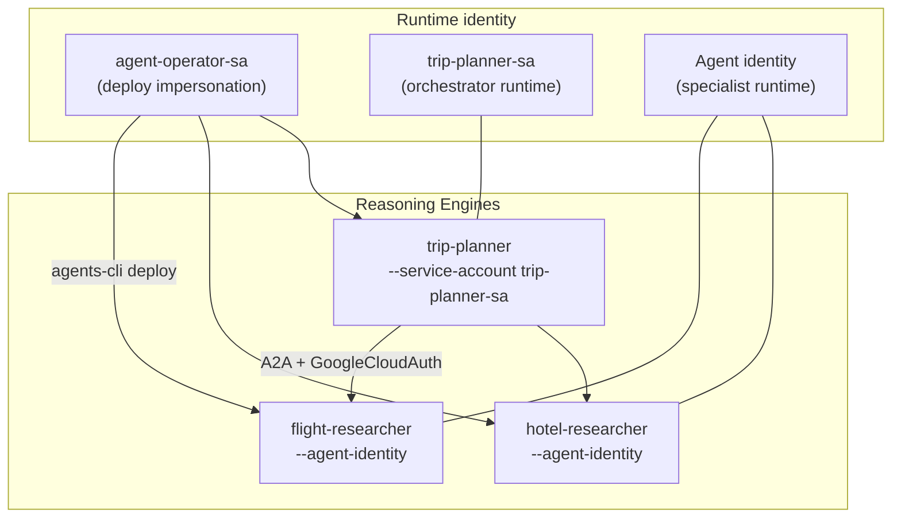
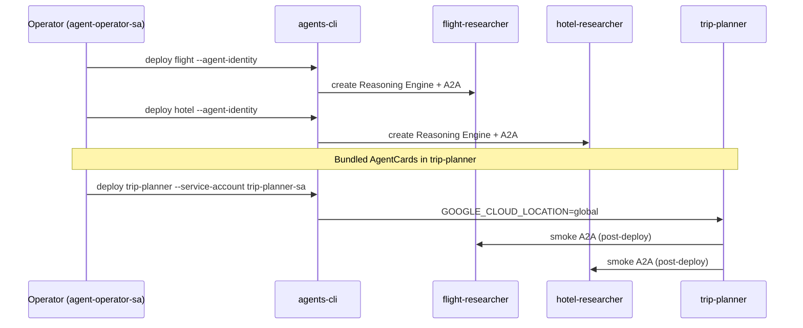

# 02 — Private IAM deploy

Deploy the three-agent mesh to **Agent Runtime** in `yexperiment` / `asia-northeast1`. Deploy **leaf specialists first**, then the orchestrator.

**Previous:** [01 — Local mesh](01-local-mesh.md) | **Next:** [03 — Auth gateway](03-auth-gateway.md)

---

## What you will learn

- How Agent Runtime maps to **Reasoning Engines** and engine IDs
- Why specialists and orchestrator use **different runtime identities**
- The correct **deploy order** (flight → hotel → trip-planner)
- How to smoke-test A2A after deploy

---

## Concepts

### Reasoning Engine

When you `agents-cli deploy`, Agent Platform creates a **Reasoning Engine**—a managed runtime for your ADK app. Each engine gets a numeric **ID** and URLs for query and A2A.

| Agent             | Engine ID (live)      | Identity mode                       |
| ----------------- | --------------------- | ----------------------------------- |
| flight-researcher | `8436148099646226432` | `--agent-identity`                  |
| hotel-researcher  | `787347082510860288`  | `--agent-identity`                  |
| trip-planner      | `2464937943706370048` | `--service-account trip-planner-sa` |

Full URLs: [`docs/notes/2026-06-21-deploy-endpoints.md`](../notes/2026-06-21-deploy-endpoints.md).

### Deploy topology



### Why trip-planner uses a service account

Outbound A2A from `--agent-identity` returned **401** until registry OAuth bindings exist (M3-2b). Specialists stay on **agent identity**; the orchestrator uses **`trip-planner-sa`** with ADC via `GoogleCloudAuth` in `a2a_auth.py`.

> Agent Platform **does not allow** `--service-account` and `--agent-identity` on the same engine update. Recreate trip-planner if switching identity mode.

Details: [`docs/notes/2026-06-21-a2a-mesh-refactor.md`](../notes/2026-06-21-a2a-mesh-refactor.md).

### Bundled AgentCards

Specialist AgentCards live in `src/trip-planner/app/cards/`. No `FLIGHT_A2A_CARD_URL` env vars at deploy time—the orchestrator package embeds deployed URLs.

---

## Prerequisites

| Requirement                | Notes                                                                   |
| -------------------------- | ----------------------------------------------------------------------- |
| Terraform applied          | Service accounts exist — [`terraform/main.tf`](../../terraform/main.tf) |
| `agents-cli` + agent venvs | `agents-cli install` in each `src/*` directory                          |
| Operator impersonation     | Deploy runs as `agent-operator-sa`                                      |

```bash
export GOOGLE_IMPERSONATE_SERVICE_ACCOUNT=agent-operator-sa@yexperiment.iam.gserviceaccount.com
export GOOGLE_CLOUD_PROJECT=yexperiment
export GOOGLE_CLOUD_LOCATION=asia-northeast1
gcloud auth application-default login   # if not already done
```

---

## Walkthrough

### Step 1 — Enhance for Agent Runtime (once per agent)

If not already enhanced:

```bash
cd src/flight-researcher
agents-cli scaffold enhance . --deployment-target agent_runtime --region asia-northeast1 -y --skip-checks

cd ../hotel-researcher
agents-cli scaffold enhance . --deployment-target agent_runtime --region asia-northeast1 -y --skip-checks

cd ../trip-planner
agents-cli scaffold enhance . --deployment-target agent_runtime --region asia-northeast1 -y --skip-checks
```

### Step 2 — Deploy specialists (agent identity)

Use `gemini-3.1-flash-lite` with **`GOOGLE_CLOUD_LOCATION=global`** (model availability).

```bash
cd src/flight-researcher
agents-cli deploy --project yexperiment --region asia-northeast1 \
  --agent-identity --no-confirm-project \
  --update-env-vars "GOOGLE_CLOUD_LOCATION=global"

cd ../hotel-researcher
agents-cli deploy --project yexperiment --region asia-northeast1 \
  --agent-identity --no-confirm-project \
  --update-env-vars "GOOGLE_CLOUD_LOCATION=global"
```

### Step 3 — Deploy orchestrator (service account)

```bash
cd ../trip-planner
agents-cli deploy --project yexperiment --region asia-northeast1 \
  --service-account trip-planner-sa@yexperiment.iam.gserviceaccount.com \
  --no-confirm-project \
  --update-env-vars "GOOGLE_CLOUD_LOCATION=global"
```

After deploy, update bundled cards if engine IDs changed, then redeploy trip-planner.



### A2A AgentCard deploy shim (specialists)

If deploy fails with `'AgentCard' object has no attribute 'DESCRIPTOR'`, ensure `app/app_utils/a2a_deploy_shim.py` is wired in `agent_runtime_app.py` (included in this repo).

---

## Verify

```bash
# Deploy status (if --no-wait was used)
agents-cli deploy --status

# End-to-end A2A smoke
cd src/trip-planner
agents-cli run --url \
  "https://asia-northeast1-aiplatform.googleapis.com/v1beta1/projects/yexperiment/locations/asia-northeast1/reasoningEngines/2464937943706370048" \
  --mode adk \
  "Plan NYC to SFO with flights and hotels."
```

| Check       | Pass criteria                                                                                                                                                                               |
| ----------- | ------------------------------------------------------------------------------------------------------------------------------------------------------------------------------------------- |
| Console     | [trip-planner playground](https://console.cloud.google.com/vertex-ai/agents/agent-engines/locations/asia-northeast1/agent-engines/2464937943706370048/playground?project=yexperiment) loads |
| Smoke run   | Response includes flight and hotel content                                                                                                                                                  |
| Cloud Trace | Spans show trip-planner → specialist A2A ([tracing docs](https://docs.cloud.google.com/gemini-enterprise-agent-platform/optimize/observability/traces))                                     |

**Private access:** No public endpoints. Programmatic callers use IAM tokens ([03-auth-gateway.md](03-auth-gateway.md)). Human users use Agent Gateway OAuth (M3-2b, deferred).

---

## Troubleshooting

| Symptom                                          | Likely cause                                    | Fix                                                            |
| ------------------------------------------------ | ----------------------------------------------- | -------------------------------------------------------------- |
| Deploy permission denied                         | Wrong impersonation                             | Set `GOOGLE_IMPERSONATE_SERVICE_ACCOUNT=agent-operator-sa@...` |
| Model not found in region                        | Regional model gap                              | Set `GOOGLE_CLOUD_LOCATION=global`                             |
| 401 on outbound A2A                              | Orchestrator on agent-identity without bindings | Deploy with `--service-account trip-planner-sa@...`            |
| Cannot switch identity on same engine            | Platform constraint                             | Delete and recreate trip-planner engine                        |
| AgentCard DESCRIPTOR error                       | Pydantic/protobuf mismatch                      | Use `a2a_deploy_shim.py` on specialists                        |
| Stale specialist URLs in orchestrator            | Engine IDs changed                              | Update `app/cards/*.json`, redeploy trip-planner               |
| `terraform/registry/mesh-agents.env` smoke fails | Stale trip-planner ID                           | Update `TRIP_PLANNER_*` to current engine ID                   |

---

## Further reading

- [Agent CLI — Deployment](https://google.github.io/agents-cli/guide/deployment/)
- [Agent CLI — Authentication](https://google.github.io/agents-cli/guide/authentication/)
- [Deploy an agent (platform)](https://docs.cloud.google.com/gemini-enterprise-agent-platform/scale/runtime/deploy-an-agent)
- [Agent identity](https://docs.cloud.google.com/gemini-enterprise-agent-platform/scale/runtime/agent-identity)
- [Manage agent access](https://docs.cloud.google.com/gemini-enterprise-agent-platform/scale/runtime/manage-agent-access)

---

## Next step

Control **who can call in**: **[03 — Auth gateway](03-auth-gateway.md)**.
