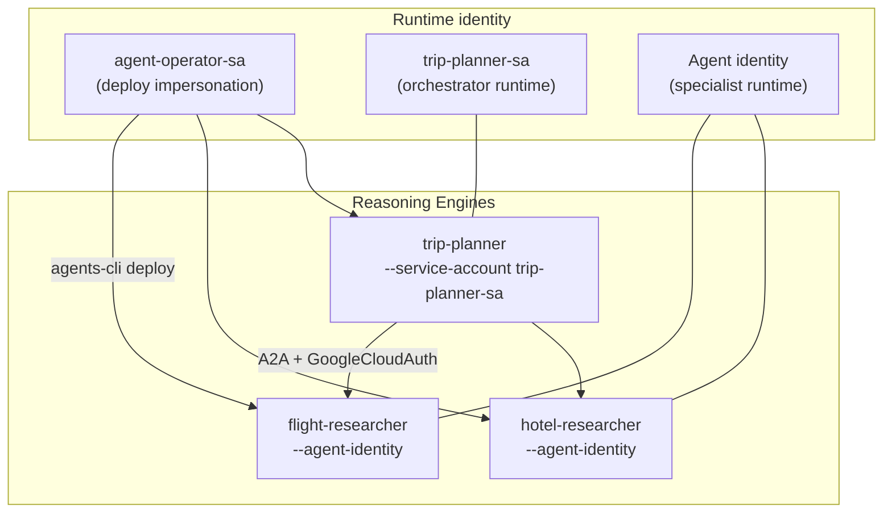
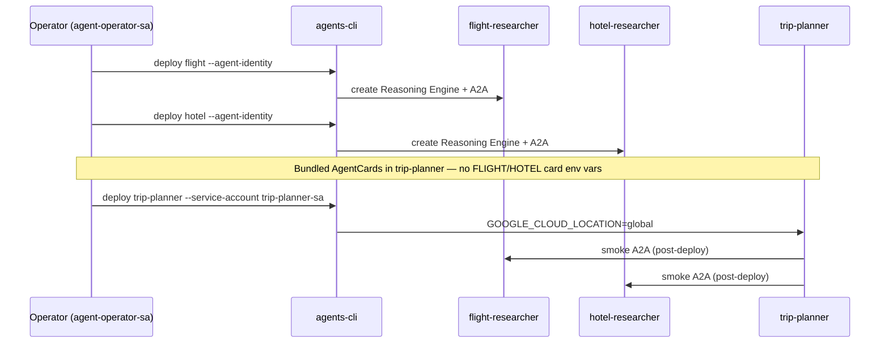

# 02 — Private IAM deploy

Deploy the three-agent mesh to **Agent Runtime** in `yexperiment` / `asia-northeast1`. Deploy **leaf specialists first**, then the orchestrator.

## Deploy topology



> **Why trip-planner uses a service account:** Outbound A2A from `--agent-identity` returned **401** until registry bindings exist (M3-2b). Specialists stay on agent identity; orchestrator uses **`trip-planner-sa`** with ADC via `GoogleCloudAuth`. Revisit agent identity after OAuth + bindings—see [A2A refactor notes](../notes/2026-06-21-a2a-mesh-refactor.md).

Agent Platform **does not allow** `--service-account` and `--agent-identity` on the same engine update. Recreate trip-planner if switching identity mode.

## Prerequisites

- Terraform applied ([`terraform/`](../../terraform/main.tf) — service accounts exist)
- Impersonate operator SA:

```bash
export GOOGLE_IMPERSONATE_SERVICE_ACCOUNT=agent-operator-sa@yexperiment.iam.gserviceaccount.com
export GOOGLE_CLOUD_PROJECT=yexperiment
export GOOGLE_CLOUD_LOCATION=asia-northeast1
```

## Enhance for Agent Runtime

```bash
cd src/flight-researcher
agents-cli scaffold enhance . --deployment-target agent_runtime --region asia-northeast1 -y --skip-checks

cd ../hotel-researcher
agents-cli scaffold enhance . --deployment-target agent_runtime --region asia-northeast1 -y --skip-checks

cd ../trip-planner
agents-cli scaffold enhance . --deployment-target agent_runtime --region asia-northeast1 -y --skip-checks
```

## Deploy sequence



### Specialists (agent identity)

```bash
cd src/flight-researcher
agents-cli deploy --project yexperiment --region asia-northeast1 \
  --agent-identity --no-confirm-project \
  --update-env-vars "GOOGLE_CLOUD_LOCATION=global"

cd ../hotel-researcher
agents-cli deploy --project yexperiment --region asia-northeast1 \
  --agent-identity --no-confirm-project \
  --update-env-vars "GOOGLE_CLOUD_LOCATION=global"
```

Use `gemini-3.1-flash-lite` with **`GOOGLE_CLOUD_LOCATION=global`** (model not available in all regions).

### Orchestrator (service account)

Specialist AgentCards are **bundled** in `src/trip-planner/app/cards/`—no `FLIGHT_A2A_CARD_URL` / `HOTEL_A2A_CARD_URL` at deploy time.

```bash
cd ../trip-planner
agents-cli deploy --project yexperiment --region asia-northeast1 \
  --service-account trip-planner-sa@yexperiment.iam.gserviceaccount.com \
  --no-confirm-project \
  --update-env-vars "GOOGLE_CLOUD_LOCATION=global"
```

Live IDs: [`docs/notes/2026-06-21-deploy-endpoints.md`](../notes/2026-06-21-deploy-endpoints.md).

### A2A AgentCard deploy shim (specialists)

If deploy fails with `'AgentCard' object has no attribute 'DESCRIPTOR'`, ensure `app/app_utils/a2a_deploy_shim.py` is wired in `agent_runtime_app.py` (included in this repo).

## Verify

```bash
agents-cli deploy --status   # if --no-wait was used
agents-cli run --url <trip-planner-url> --mode adk "Plan NYC to SFO with flights and hotels."
```

- **Console playground:** link in deploy-endpoints note
- **Cloud Trace:** A2A spans trip-planner → specialists ([tracing docs](https://docs.cloud.google.com/gemini-enterprise-agent-platform/optimize/observability/traces))

## Private access

- No public or unauthenticated endpoints
- Programmatic callers: IAM identity tokens ([03-auth-gateway.md](03-auth-gateway.md))
- Human users: Agent Gateway OAuth (M3-2b, deferred)

## Next steps

- IAM ingress: [03-auth-gateway.md](03-auth-gateway.md)
- Registry + IAP: [04-mesh-governance.md](04-mesh-governance.md)
