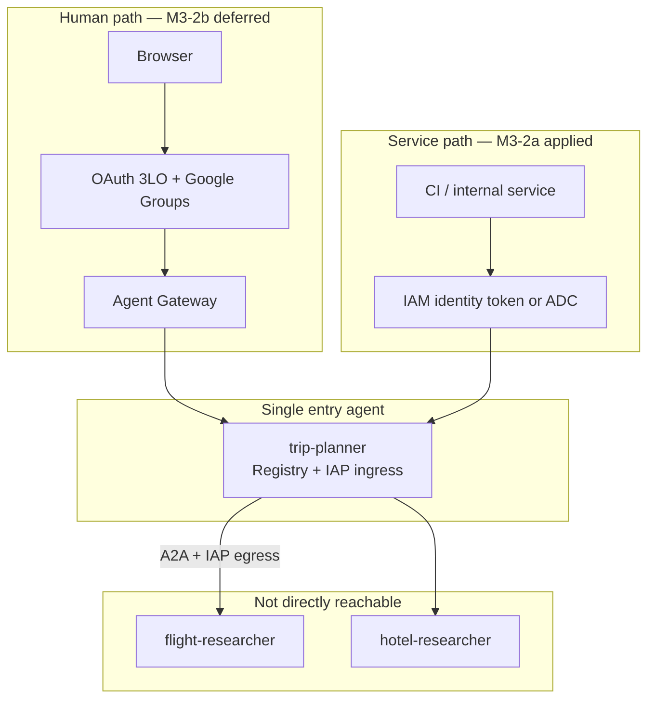
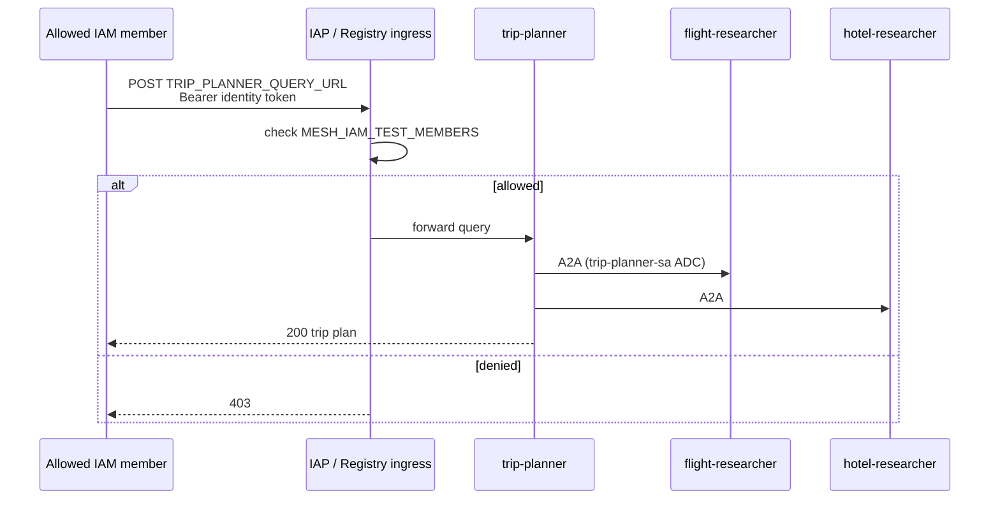
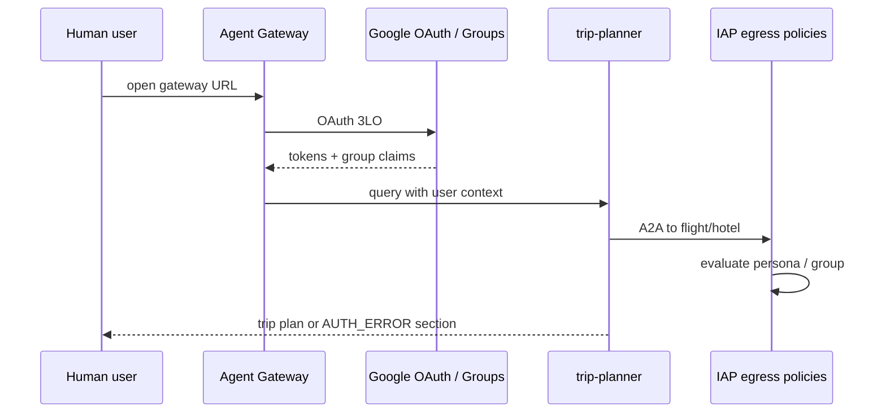

# 03 — Agent Gateway + auth paths

Human users reach **trip-planner only** via Agent Gateway (M3-2b). Specialists are **not** public; the orchestrator invokes them over governed A2A. Internal services use **IAM ingress** (M3-2a, applied).

**Previous:** [02 — IAM deploy](02-iam-deploy.md) | **Next:** [04 — Mesh governance](04-mesh-governance.md)

---

## What you will learn

- The three ways callers reach trip-planner (IAM, OAuth, developer)
- **2LO vs 3LO** in plain terms and which path this mesh uses
- How to run an **IAM ingress smoke test** with `curl`
- What M3-2b (OAuth Gateway) adds and why it is deferred

---

## Concepts

### Auth path overview



| Path                 | Caller                  | Token                         | Status   |
| -------------------- | ----------------------- | ----------------------------- | -------- |
| M3-2a IAM ingress    | CI, ADC user, operators | Identity token / access token | Applied  |
| M3-2b OAuth Gateway  | Browser users           | OAuth 3LO + group claims      | Deferred |
| Console / agents-cli | Developers              | User GCP credentials          | Ad hoc   |

Specialists have **no public ingress**. Only trip-planner accepts external queries.

### IAM auth primer (2LO vs 3LO)

| Mode    | Name                            | Who authenticates                       | Typical use in this mesh                        |
| ------- | ------------------------------- | --------------------------------------- | ----------------------------------------------- |
| **ADC** | Application Default Credentials | Your user or workload on the machine    | `agents-cli run`, local dev                     |
| **2LO** | Two-legged OAuth                | Service account alone (no user consent) | Server-to-server, trip-planner → specialist A2A |
| **3LO** | Three-legged OAuth              | User signs in and consents              | Browser users via Agent Gateway                 |

**Key idea:** M3-2a checks **who you are** (IAM member) before forwarding to trip-planner. M3-2b additionally attaches **user group claims** for persona-based egress (guide 04).

Docs:

- [Application Default Credentials](https://cloud.google.com/docs/authentication/application-default-credentials)
- [Auth with 2LO](https://docs.cloud.google.com/iam/docs/auth-with-2lo)
- [Auth with 3LO](https://docs.cloud.google.com/iam/docs/auth-with-3lo)

API keys are **not** used for this private mesh.

---

## Prerequisites

- [02-iam-deploy.md](02-iam-deploy.md) complete (agents on Agent Runtime)
- Three agents registered (auto on deploy with `--agent-identity`)
- Registry services created — [04-mesh-governance.md](04-mesh-governance.md)
- Your user in `MESH_IAM_TEST_MEMBERS` for smoke tests

---

## Walkthrough

### M3-2a — Apply IAM ingress

Grant selected IAM members access to trip-planner's registry agent (UID, not Reasoning Engine numeric ID).

```bash
export MESH_IAM_TEST_MEMBERS="user:you@example.com"
./terraform/scripts/apply_mesh_governance.sh
```

Phase 3 of the script sets `roles/iap.httpsResourceAccessor` on the **trip-planner registry agent**.



### M3-2a — Smoke test

Source IDs from [`terraform/registry/mesh-agents.env`](../../terraform/registry/mesh-agents.env). **Update `TRIP_PLANNER_*` IDs** if trip-planner was recreated (current engine: `2464937943706370048`).

```bash
source terraform/registry/mesh-agents.env

# Option A: gcloud user identity token
curl -sS -X POST \
  -H "Authorization: Bearer $(gcloud auth print-identity-token)" \
  -H "Content-Type: application/json" \
  -d '{"input":{"text":"Plan NYC to San Francisco with flights and hotels."}}' \
  "${TRIP_PLANNER_QUERY_URL}"

# Option B: Application Default Credentials access token
curl -sS -X POST \
  -H "Authorization: Bearer $(gcloud auth application-default print-access-token)" \
  -H "Content-Type: application/json" \
  -d '{"input":{"text":"Plan NYC to San Francisco with flights and hotels."}}' \
  "${TRIP_PLANNER_QUERY_URL}"
```

### M3-2b — OAuth Gateway (deferred)

Gateway OAuth needs an OAuth client, auth provider binding, and real Google Groups. **Not applied in the IAM-first pass.**



When ready:

1. [Set up Agent Gateway](https://docs.cloud.google.com/gemini-enterprise-agent-platform/govern/gateways/set-up-agent-gateway)
2. Bind gateway to Agent Registry
3. Configure OAuth ingress for trip-planner only
4. Set `AUTH_PROVIDER_BINDING` and re-run `./terraform/scripts/apply_mesh_governance.sh`
5. Start authorization in **DRY_RUN**, then enforce ([delegate authorization](https://docs.cloud.google.com/gemini-enterprise-agent-platform/govern/gateways/delegate-authorization))

---

## Verify

| Test               | Command / action                                         | Expected                                   |
| ------------------ | -------------------------------------------------------- | ------------------------------------------ |
| Allowed member     | `curl` smoke with your user token                        | HTTP **200**, trip plan JSON               |
| Denied member      | Same `curl` from user **not** in `MESH_IAM_TEST_MEMBERS` | HTTP **403**                               |
| Console playground | Open trip-planner playground                             | Works with your GCP login (developer path) |

---

## Troubleshooting

| Symptom                        | Likely cause                                        | Fix                                                   |
| ------------------------------ | --------------------------------------------------- | ----------------------------------------------------- |
| 403 on IAM smoke               | User not in `MESH_IAM_TEST_MEMBERS`                 | Re-run apply script with your `user:email`            |
| 404 on query URL               | Stale `TRIP_PLANNER_QUERY_URL` in `mesh-agents.env` | Update engine/registry IDs after redeploy             |
| 401 on curl                    | Expired or wrong token type                         | Retry `gcloud auth print-identity-token` or ADC login |
| Gateway tests blocked          | M3-2b not configured                                | Expected until OAuth + groups are wired               |
| Specialists reachable directly | Misconfigured ingress                               | Specialists should not expose public query URLs       |

### Do not commit

- OAuth client secrets
- Gateway private keys
- `.env` files with credentials

Store secrets in Secret Manager only.

---

## Further reading

- [Manage agent access](https://docs.cloud.google.com/gemini-enterprise-agent-platform/scale/runtime/manage-agent-access)
- [Agent Gateway overview](https://docs.cloud.google.com/gemini-enterprise-agent-platform/govern/gateways/agent-gateway-overview)
- [Set up Agent Gateway](https://docs.cloud.google.com/gemini-enterprise-agent-platform/govern/gateways/set-up-agent-gateway)
- [Auth with 3LO](https://docs.cloud.google.com/iam/docs/auth-with-3lo)

---

## Next step

Per-agent egress and persona matrix: **[04 — Mesh governance](04-mesh-governance.md)**.
