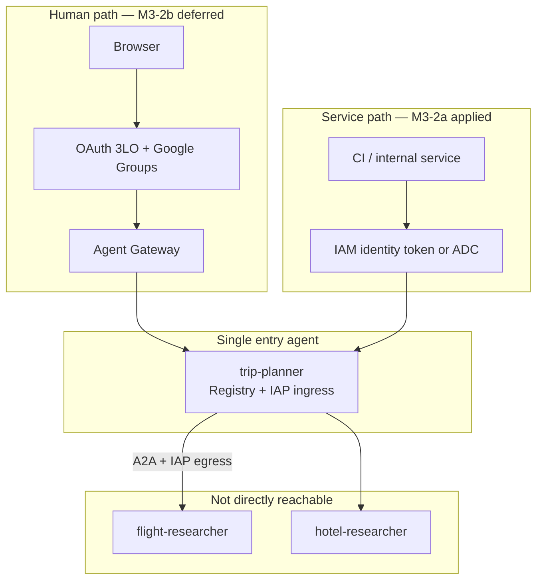
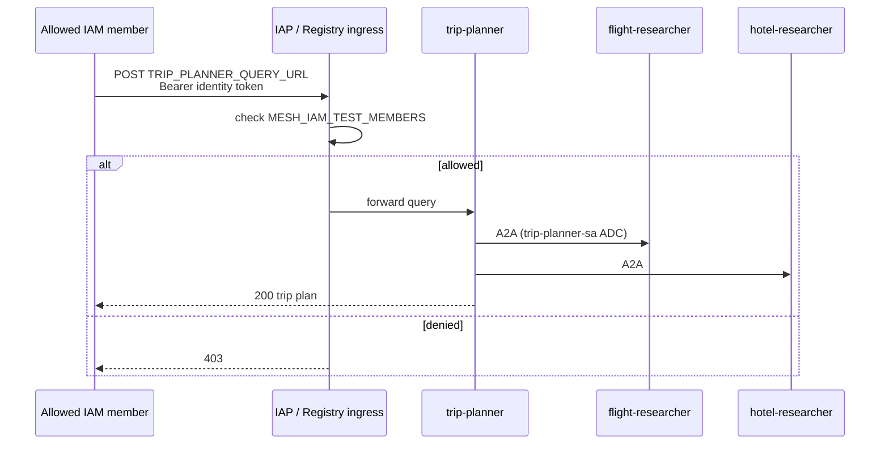
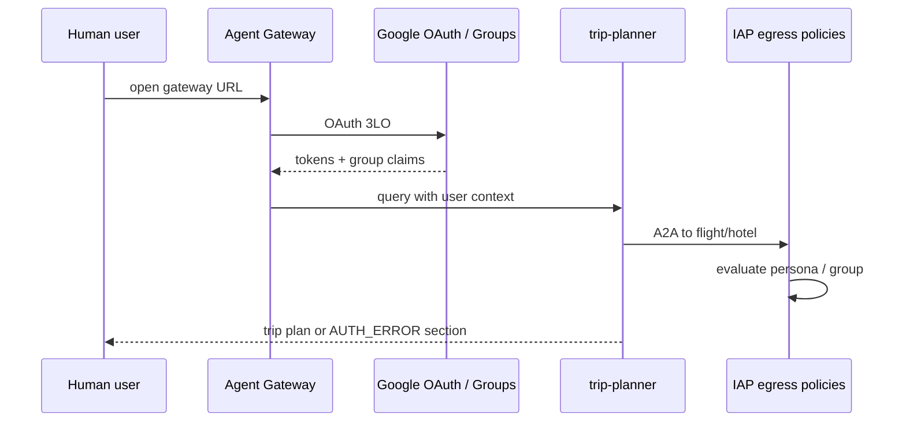

# 03 — Agent Gateway + auth paths

Human users reach **trip-planner only** via Agent Gateway (M3-2b). Specialists are **not** public; the orchestrator invokes them over governed A2A. Internal services use **IAM ingress** (M3-2a, applied).

## Auth path overview



| Path                 | Caller                  | Token                         | Status   |
| -------------------- | ----------------------- | ----------------------------- | -------- |
| M3-2a IAM ingress    | CI, ADC user, operators | Identity token / access token | Applied  |
| M3-2b OAuth Gateway  | Browser users           | OAuth 3LO + group claims      | Deferred |
| Console / agents-cli | Developers              | User GCP credentials          | Ad hoc   |

## Prerequisites

- [02-iam-deploy.md](02-iam-deploy.md) complete (agents on Agent Runtime)
- Three agents in **Agent Registry** (auto on deploy with `--agent-identity`)
- Registry services created — [04-mesh-governance.md](04-mesh-governance.md)

## M3-2a — IAM ingress (programmatic)

Internal callers POST to the trip-planner **query URL** with an IAM-scoped bearer token. No OAuth.

### Apply IAM ingress

```bash
export MESH_IAM_TEST_MEMBERS="user:you@example.com"
./terraform/scripts/apply_mesh_governance.sh
```

Phase 3 grants `roles/iap.httpsResourceAccessor` on the **trip-planner registry agent** (registry UID, not Reasoning Engine numeric ID).



### Smoke test

Source IDs from [`terraform/registry/mesh-agents.env`](../../terraform/registry/mesh-agents.env). **Update `TRIP_PLANNER_*` IDs** after trip-planner engine recreation if smoke fails.

```bash
source terraform/registry/mesh-agents.env

# Option A: gcloud user identity token
curl -sS -X POST \
  -H "Authorization: Bearer $(gcloud auth print-identity-token)" \
  -H "Content-Type: application/json" \
  -d '{"input":{"text":"Plan NYC to San Francisco with flights and hotels."}}' \
  "${TRIP_PLANNER_QUERY_URL}"

# Option B: Application Default Credentials access token
curl -sS -X POST \
  -H "Authorization: Bearer $(gcloud auth application-default print-access-token)" \
  -H "Content-Type: application/json" \
  -d '{"input":{"text":"Plan NYC to San Francisco with flights and hotels."}}' \
  "${TRIP_PLANNER_QUERY_URL}"
```

HTTP **200** when the caller is in `MESH_IAM_TEST_MEMBERS`; **403** otherwise.

See [manage agent access](https://docs.cloud.google.com/gemini-enterprise-agent-platform/scale/runtime/manage-agent-access).

## M3-2b — OAuth Gateway (human users) — deferred

Gateway OAuth requires an OAuth client, auth provider binding, and real Google Groups. **Not applied in the IAM-first pass.**



When ready:

1. Create Agent Gateway in `yexperiment` / `asia-northeast1` ([set up Agent Gateway](https://docs.cloud.google.com/gemini-enterprise-agent-platform/govern/gateways/set-up-agent-gateway))
2. Bind gateway to Agent Registry
3. Configure OAuth ingress for trip-planner only
4. Set `AUTH_PROVIDER_BINDING` and re-run `./terraform/scripts/apply_mesh_governance.sh` (enables trip-planner→flight/hotel **registry bindings**)
5. Start authorization in **DRY_RUN**, then enforce ([delegate authorization](https://docs.cloud.google.com/gemini-enterprise-agent-platform/govern/gateways/delegate-authorization))

See [auth with 3LO](https://docs.cloud.google.com/iam/docs/auth-with-3lo).

## Do not commit

- OAuth client secrets
- Gateway private keys
- `.env` with credentials

Store secrets in Secret Manager only.

## Next steps

- Persona matrix and IAP egress: [04-mesh-governance.md](04-mesh-governance.md)
