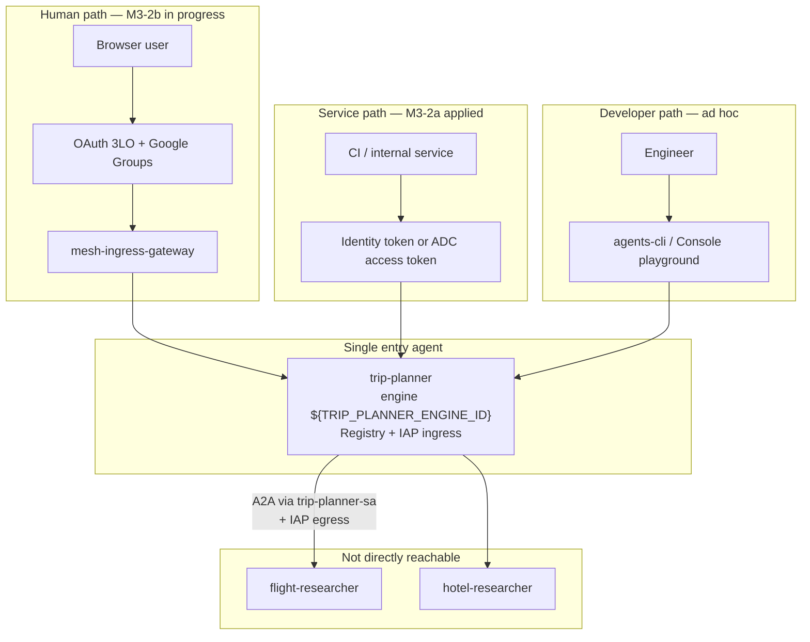
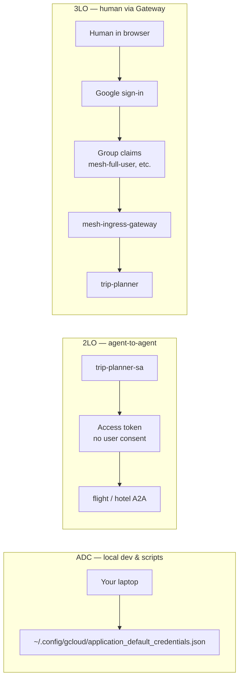
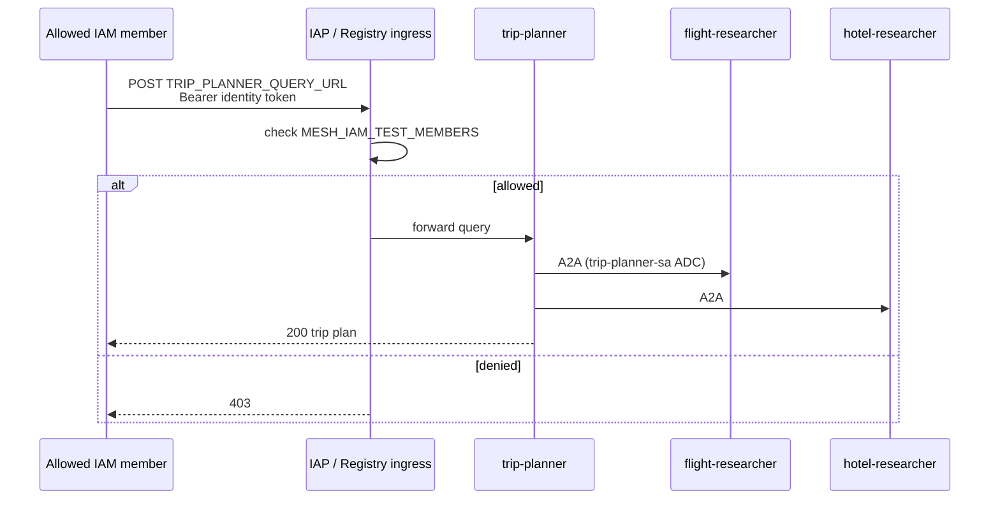
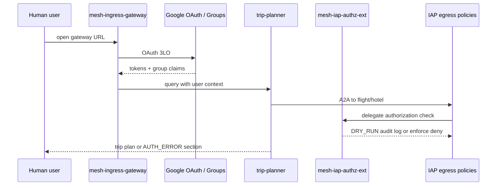

# 03 — Agent Gateway + auth paths

Human users reach **trip-planner only** via Agent Gateway (M3-2b). Specialists are **not** public; the orchestrator invokes them over governed A2A. Internal services and operators use **IAM ingress** (M3-2a, already applied in this demo).

**Previous:** [02 — IAM deploy](02-iam-deploy.md) | **Next:** [04 — Mesh governance](04-mesh-governance.md)

---

## What you will learn

- The three ways callers reach trip-planner: IAM ingress, OAuth Gateway, and developer console
- How **ADC**, **2LO**, and **3LO** differ and which path this mesh uses at each hop
- How to run an **IAM ingress smoke test** with `curl` and interpret HTTP status codes
- What M3-2b adds (OAuth 3LO, group claims, delegate authorization) and what is already live vs deferred

---

## Concepts

### Who can call trip-planner?

**In plain English:** Trip-planner is the only agent with a front door. Humans will eventually use a browser and sign in with Google (OAuth). Machines and operators use IAM tokens today. Developers use the console or `agents-cli` with their own GCP login. Flight and hotel specialists have no public door—only trip-planner talks to them.



### How to read this diagram — how-to-read-this-diagram-how-t (1)

- **Three arrows into trip-planner** — IAM (curl/CI), OAuth Gateway (browser), and developer tools all target the orchestrator only.
- **No arrows into flight/hotel** — specialists are reachable only through trip-planner's outbound A2A calls.
- **mesh-ingress-gateway** — the human-facing Agent Gateway; OAuth connector `mesh-oauth-3lo` is not created yet in this demo.
- **trip-planner-sa** — the service account trip-planner uses for outbound A2A until registry bindings (M3-2b) are complete.
- **M3-2a vs M3-2b** — IAM ingress is applied today; OAuth Gateway wiring is the next milestone (guide 05).

| Path                 | Caller                  | Token type                    | Status in `<your-gcp-project>`    |
| -------------------- | ----------------------- | ----------------------------- | --------------------------------- |
| M3-2a IAM ingress    | CI, ADC user, operators | Identity / access token (IAM) | Applied via governance script     |
| M3-2b OAuth Gateway  | Browser users           | OAuth 3LO + group claims      | Gateways exist; connector pending |
| Console / agents-cli | Developers              | User GCP credentials          | Ad hoc for engineering            |

### ADC vs 2LO vs 3LO

**In plain English:** **ADC** (Application Default Credentials) is how code on your laptop finds _some_ credential—usually your user login after `gcloud auth application-default login`. **2LO** (two-legged OAuth) is machine-to-machine: a service account gets a token without a human clicking "Allow." **3LO** (three-legged OAuth) adds a human: the user signs in, consents, and the platform receives tokens _and_ identity claims (including Google Group membership for our persona matrix).



### How to read this diagram — how-to-read-this-diagram-how-t (2)

- **ADC** — used by `apply_mesh_governance.sh`, `check_mesh_gateway_status.sh`, and Option B of the curl smoke test; not the same as end-user OAuth.
- **2LO** — trip-planner → specialist calls today use `trip-planner-sa` credentials; IAP egress policies decide whether that call is allowed for a given user context once delegate auth is wired.
- **3LO** — browser users authenticate through Google; group membership drives the persona matrix (`mesh-full-user`, `mesh-flight-user`, `mesh-hotel-user`, `mesh-deny-user`).
- **Left-to-right layout** — three independent auth modes for three different callers, not a single login flow.
- **Specialist box under 2LO** — outbound A2A is always server-side; humans never call specialists directly.

| Mode    | Legs | Who proves identity              | Used in this mesh for                                   |
| ------- | ---- | -------------------------------- | ------------------------------------------------------- |
| **ADC** | 0–1  | Developer or workload on machine | Scripts, local `agents-cli`, governance apply           |
| **2LO** | 2    | Service account only             | trip-planner → flight/hotel A2A (via `trip-planner-sa`) |
| **3LO** | 3    | Human + client + Google          | Browser users via `mesh-ingress-gateway` (M3-2b)        |

API keys are **not** used for this private mesh.

### IAM ingress (M3-2a)

**In plain English:** Before trip-planner runs your prompt, IAP checks whether your IAM principal (for example `user:you@example.com`) is on the allow list. The check uses the **registry agent UID** from `mesh-agents.env`, not the numeric Reasoning Engine ID. If you are allowed, the query reaches engine `${TRIP_PLANNER_ENGINE_ID}`; if not, you get **403 Forbidden** before the agent sees the request.



### How to read this diagram — how-to-read-this-diagram-how-t (3)

- **Caller → IAP first** — authentication and authorization happen at the platform edge, not inside Python agent code.
- **Bearer identity token** — from `gcloud auth print-identity-token` or an ADC access token; must match an IAM member granted `roles/iap.httpsResourceAccessor`.
- **403 on denied** — IAP rejected the caller; trip-planner never executed.
- **200 on allowed** — orchestrator may still fail a specialist call if egress policies deny that persona (guide 04); that is a different layer.
- **trip-planner-sa on A2A** — outbound calls use the orchestrator service account until M3-2b registry bindings replace this pattern.

### OAuth Gateway (M3-2b)

**In plain English:** A human opens the ingress gateway URL, signs in with Google (3LO), and the gateway forwards the query to trip-planner with **user context** attached. Delegate authorization (`mesh-iap-authz-ext`, currently `iamEnforcementMode: DRY_RUN`) logs what IAP _would_ enforce on egress without blocking yet. Registry bindings (`trip-planner-to-flight`, `trip-planner-to-hotel`) are skipped until you export `AUTH_PROVIDER_BINDING` pointing at connector `mesh-oauth-3lo`.



### How to read this diagram — how-to-read-this-diagram-how-t (4)

- **GW → IdP → GW** — classic 3LO: user consent happens at Google, not on the agent.
- **Group claims** — map test users into personas (`mesh-full-user`, `mesh-flight-user`, `mesh-hotel-user`, `mesh-deny-user`).
- **mesh-iap-authz-ext** — bridges gateway user identity to IAP egress evaluation; **DRY_RUN** means log-only until you switch to enforce (guide 05).
- **Pol / Authz interaction** — egress IAP policies on registry agents decide flight vs hotel access per persona.
- **AUTH_ERROR in response** — orchestrator may return partial results when a specialist call is denied under DRY_RUN or enforce.

### Token flow for curl smoke test

**In plain English:** The smoke test sends a JSON body to `TRIP_PLANNER_QUERY_URL` with an `Authorization: Bearer` header. Option A uses a **Google identity token** tied to your gcloud user. Option B uses an **OAuth access token** from ADC. Both must represent an IAM principal listed in `MESH_IAM_TEST_MEMBERS`.

```mermaid
flowchart TB
  subgraph OptionA["Option A — identity token"]
    A1["gcloud auth print-identity-token"]
    A2["Bearer token in curl -H"]
    A1 --> A2
  end

  subgraph OptionB["Option B — ADC access token"]
    B1["gcloud auth application-default login"]
    B2["gcloud auth application-default print-access-token"]
    B3["Bearer token in curl -H"]
    B1 --> B2 --> B3
  end

  subgraph Request["HTTP POST"]
    URL["TRIP_PLANNER_QUERY_URL<br/>reasoningEngines/${TRIP_PLANNER_ENGINE_ID}:query"]
    Body['{"input":{"text":"Plan NYC to SFO..."}}']
    A2 --> URL
    B3 --> URL
    Body --> URL
  end

  subgraph Response["Typical outcomes"]
    R200["200 — allowed member, agent ran"]
    R403["403 — IAM ingress denied"]
    R400["400 — bad JSON or malformed request"]
    R401["401 — missing/expired/wrong token"]
    URL --> R200
    URL --> R403
    URL --> R400
    URL --> R401
  end
```

### How to read this diagram — how-to-read-this-diagram-how-t (5)

- **Two token sources** — either works if the underlying principal is in `MESH_IAM_TEST_MEMBERS`; identity tokens are often simpler for user smoke tests.
- **TRIP_PLANNER_QUERY_URL** — defined in `terraform/registry/mesh-agents.env`; must match live engine `${TRIP_PLANNER_ENGINE_ID}`.
- **403 vs 401** — 401 means the token itself is invalid; 403 means the token was valid but IAP rejected the principal.
- **400 vs 403** — 400 is a client mistake (wrong JSON shape, missing `input`); 403 is authorization. Do not confuse a malformed body with "access denied."
- **200 does not guarantee full mesh** — ingress passed; egress persona rules may still block flight or hotel under governance (guide 04).

---

## Prerequisites

- [02 — IAM deploy](02-iam-deploy.md) complete — three agents on Agent Runtime with `--agent-identity` (trip-planner uses `trip-planner-sa`)
- Registry agent UIDs present in `terraform/registry/mesh-agents.env`
- Your user listed in `MESH_IAM_TEST_MEMBERS` when running `./terraform/scripts/apply_mesh_governance.sh`
- ADC configured: `gcloud auth application-default login`

---

## Walkthrough

### Micro-tutorial: Apply IAM ingress (M3-2a)

Grant selected IAM members access to trip-planner's **registry agent** (UID, not Reasoning Engine numeric ID).

```bash
export MESH_IAM_TEST_MEMBERS="user:you@example.com"
./terraform/scripts/apply_mesh_governance.sh
```

Phase 3 of the script adds `roles/iap.httpsResourceAccessor` on the trip-planner registry agent. Exit **0** means all phases completed (bindings may be skipped if `AUTH_PROVIDER_BINDING` is unset—that is expected today).

### Micro-tutorial: IAM smoke test with curl

Source IDs from [`terraform/registry/mesh-agents.env`](../../terraform/registry/mesh-agents.env.example). **Update `TRIP_PLANNER_*` values** if trip-planner was recreated.

```bash
source terraform/registry/mesh-agents.env

# Option A: gcloud user identity token
curl -sS -w "\nHTTP %{http_code}\n" -X POST \
  -H "Authorization: Bearer $(gcloud auth print-identity-token)" \
  -H "Content-Type: application/json" \
  -d '{"input":{"text":"Plan NYC to San Francisco with flights and hotels."}}' \
  "${TRIP_PLANNER_QUERY_URL}"

# Option B: Application Default Credentials access token
curl -sS -w "\nHTTP %{http_code}\n" -X POST \
  -H "Authorization: Bearer $(gcloud auth application-default print-access-token)" \
  -H "Content-Type: application/json" \
  -d '{"input":{"text":"Plan NYC to San Francisco with flights and hotels."}}' \
  "${TRIP_PLANNER_QUERY_URL}"
```

**Worked example — allowed member:** HTTP **200** and JSON containing a trip plan (flights/hotels sections depend on egress policies).

**Worked example — denied member:** Same curl from a user **not** in `MESH_IAM_TEST_MEMBERS` → HTTP **403** with no agent execution.

**Worked example — bad body:** Omit `input` or send invalid JSON → HTTP **400** (request rejected by API, not IAP persona denial).

### Micro-tutorial: What is live vs deferred for M3-2b

| Resource                   | Status in `<your-gcp-project>` / `asia-northeast1` |
| -------------------------- | -------------------------------------------------- |
| `mesh-egress-gateway`      | Created                                            |
| `mesh-ingress-gateway`     | Created                                            |
| `mesh-iap-authz-ext`       | Created (`iamEnforcementMode: DRY_RUN`)            |
| `mesh-oauth-3lo` connector | **Not yet created**                                |
| Registry bindings          | **Blocked** until `AUTH_PROVIDER_BINDING` is set   |

When the OAuth connector exists, export:

```bash
export AUTH_PROVIDER_BINDING="projects/<your-gcp-project>/locations/asia-northeast1/connectors/mesh-oauth-3lo"
./terraform/scripts/apply_mesh_governance.sh
```

Full gateway + policy demo steps: **[05 — Gateway policy demo](05-gateway-policy-demo.md)**.

---

## Verify

| Test               | Command / action                                                    | Expected                                   |
| ------------------ | ------------------------------------------------------------------- | ------------------------------------------ |
| Allowed member     | curl smoke with your user token                                     | HTTP **200**, trip plan JSON               |
| Denied member      | Same curl from user not in `MESH_IAM_TEST_MEMBERS`                  | HTTP **403**                               |
| Malformed request  | POST with `{}` or missing `input`                                   | HTTP **400**                               |
| Console playground | Open trip-planner playground for engine `${TRIP_PLANNER_ENGINE_ID}` | Works with your GCP login (developer path) |

```bash
# Quick status of gateway prerequisites (OAuth connector may still fail until created)
./terraform/scripts/check_mesh_gateway_status.sh
# Exit 0 = all checks pass; Exit 1 = one or more failed; Exit 2 = missing gcloud/curl/jq
```

---

## Troubleshooting

| Symptom                        | Likely cause                                        | Fix                                                   |
| ------------------------------ | --------------------------------------------------- | ----------------------------------------------------- |
| **403** on IAM smoke           | User not in `MESH_IAM_TEST_MEMBERS`                 | Re-run apply script with your `user:email`            |
| **400** on query URL           | Malformed JSON or wrong request shape               | Use `{"input":{"text":"..."}}` exactly                |
| **404** on query URL           | Stale `TRIP_PLANNER_QUERY_URL` in `mesh-agents.env` | Update engine/registry IDs after redeploy             |
| **401** on curl                | Expired or wrong token type                         | Retry `gcloud auth print-identity-token` or ADC login |
| Gateway browser tests blocked  | `mesh-oauth-3lo` not created                        | Run `setup_agent_gateway.sh --with-oauth` (guide 05)  |
| Specialists reachable directly | Misconfigured ingress                               | Specialists should not expose public query URLs       |

### Do not commit

- OAuth client secrets
- Gateway private keys
- `.env` files with credentials

Store secrets in Secret Manager only.

---

## Appendix: Further reading

- [Application Default Credentials](https://cloud.google.com/docs/authentication/application-default-credentials)
- [Auth with 2LO](https://docs.cloud.google.com/iam/docs/auth-with-2lo)
- [Auth with 3LO](https://docs.cloud.google.com/iam/docs/auth-with-3lo)
- [Agent Gateway overview](https://docs.cloud.google.com/gemini-enterprise-agent-platform/govern/gateways/agent-gateway-overview)
- [Manage agent access](https://docs.cloud.google.com/gemini-enterprise-agent-platform/scale/runtime/manage-agent-access)
