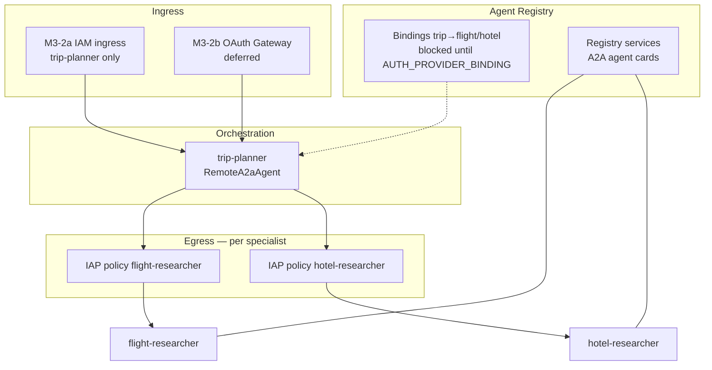
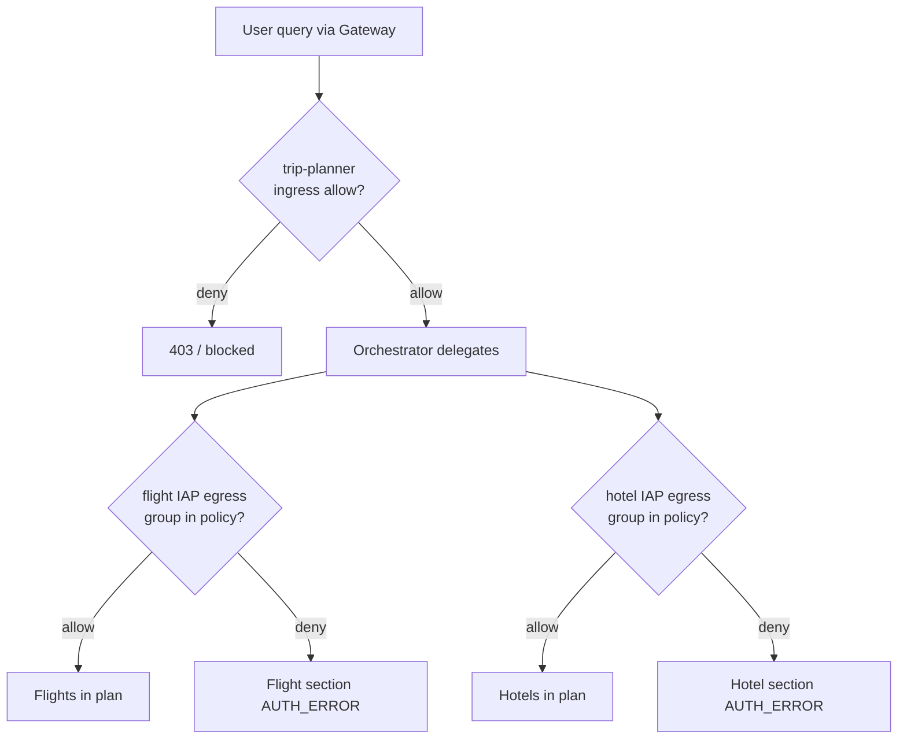
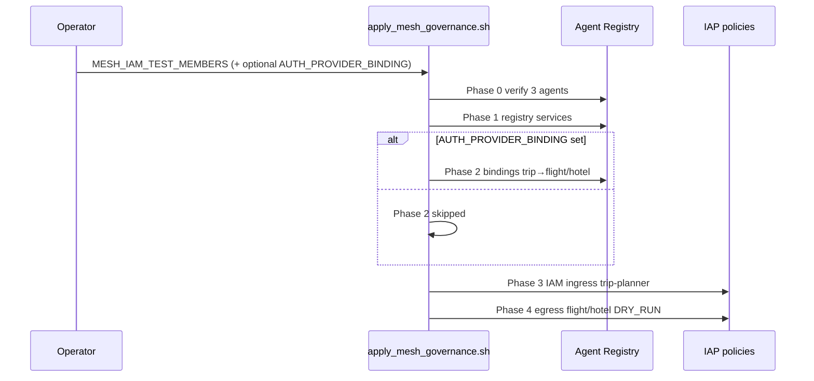
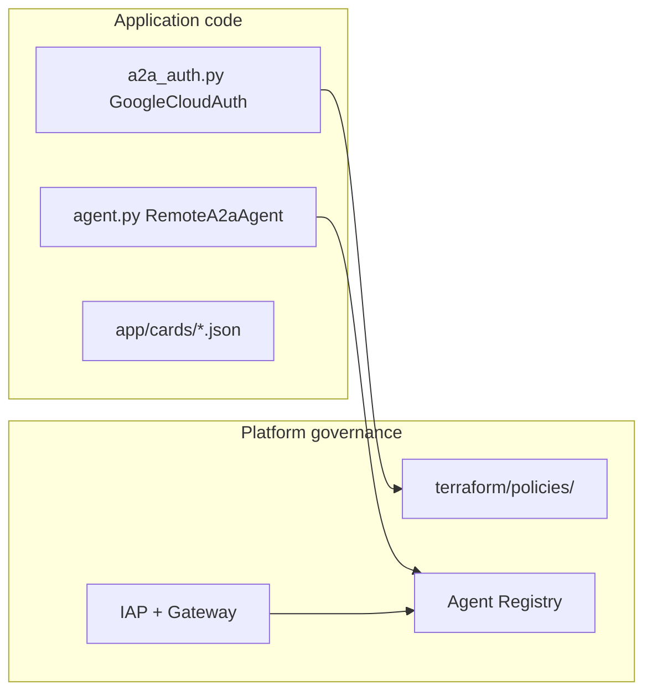

# 04 — Mesh governance

Enterprise demo: **authorization is per agent**, not only at the entry point. Enforcement is on **Agent Platform** (Agent Registry, IAP, Agent Gateway)—not custom Python auth modules.

**Previous:** [03 — Auth gateway](03-auth-gateway.md) | **Start:** [00 — Overview](00-overview.md)

---

## What you will learn

- What **Agent Registry** is and how it relates to Reasoning Engines
- The **persona matrix** (who can reach which specialist)
- How `apply_mesh_governance.sh` phases map to platform resources
- **DRY_RUN vs enforce** for IAP egress policies
- What is **code** vs **platform** responsibility

---

## Concepts

### Governance stack



| Layer           | What it controls                                     | Where in repo                        |
| --------------- | ---------------------------------------------------- | ------------------------------------ |
| **Ingress**     | Who can call trip-planner                            | Phase 3 of apply script              |
| **Egress**      | Which callers trip-planner may invoke per specialist | `terraform/policies/`                |
| **Registry**    | Agent UIDs, services, bindings                       | `terraform/registry/mesh-agents.env` |
| **Application** | A2A orchestration only                               | `src/trip-planner/app/`              |

### Registry vs Reasoning Engine

| Object                 | ID example             | Used for                                           |
| ---------------------- | ---------------------- | -------------------------------------------------- |
| **Reasoning Engine**   | `2464937943706370048`  | Deploy, console playground, `agents-cli run --url` |
| **Registry agent UID** | From `mesh-agents.env` | IAP policies, ingress, bindings                    |

IAP commands use **registry agent UID**, not the numeric Reasoning Engine ID.

### Persona matrix

Platform policies map **Google Groups** (M3-2b) to allow/deny per agent. Local unit tests cover orchestration wiring only—see `src/trip-planner/tests/unit/test_a2a_mesh.py`.

| Persona            | trip-planner | flight-researcher | hotel-researcher |
| ------------------ | :----------: | :---------------: | :--------------: |
| `mesh-full-user`   |    allow     |       allow       |      allow       |
| `mesh-flight-user` |    allow     |       allow       |       deny       |
| `mesh-hotel-user`  |    allow     |       deny        |      allow       |
| `mesh-deny-user`   |     deny     |       deny        |       deny       |



---

## Prerequisites

- Agents deployed — [02-iam-deploy.md](02-iam-deploy.md)
- IAM ingress applied (optional but recommended) — [03-auth-gateway.md](03-auth-gateway.md)
- `gcloud` with beta IAP commands
- Operator access to `yexperiment` / `asia-northeast1`

---

## Walkthrough

### Step 1 — Discover registry agents

```bash
source terraform/registry/mesh-agents.env
TOKEN="$(gcloud auth application-default print-access-token)"
curl -sS -H "Authorization: Bearer ${TOKEN}" \
  "https://agentregistry.googleapis.com/v1alpha/projects/${PROJECT}/locations/${REGION}/agents" \
  | jq '.agents[] | {uid, displayName}'
```

Use hostname **`agentregistry.googleapis.com`** (global)—not `{region}-agentregistry.googleapis.com`.

Session notes: [`docs/notes/2026-06-21-m3-discovery.md`](../notes/2026-06-21-m3-discovery.md).

### Step 2 — Run apply script

```bash
export MESH_IAM_TEST_MEMBERS="user:you@example.com"
# M3-2b only:
# export AUTH_PROVIDER_BINDING="projects/.../locations/.../authProviders/..."

./terraform/scripts/apply_mesh_governance.sh
```



| Phase | Action                                     | Status                                |
| ----- | ------------------------------------------ | ------------------------------------- |
| 0     | Verify 3 mesh agents in registry           | Done                                  |
| 1     | Create registry services (A2A agent cards) | Done (3 services)                     |
| 2     | trip-planner→flight/hotel bindings         | Blocked until `AUTH_PROVIDER_BINDING` |
| 3     | IAM ingress on trip-planner                | Done when `MESH_IAM_TEST_MEMBERS` set |
| 4     | IAP egress policies (flight/hotel)         | Applied in DRY_RUN                    |

### Step 3 — Agent-to-agent IAP policies (manual)

Templates: [`terraform/policies/`](../../terraform/policies/README.md).

```bash
./terraform/scripts/resolve_iap_policies.sh
source terraform/registry/mesh-agents.env

gcloud beta iap web set-iam-policy terraform/policies/agent-to-agent-flight.resolved.json \
  --project="${PROJECT}" --region="${REGION}" \
  --resource-type=agent-registry --agent="${FLIGHT_REGISTRY_AGENT}"

gcloud beta iap web set-iam-policy terraform/policies/agent-to-agent-hotel.resolved.json \
  --project="${PROJECT}" --region="${REGION}" \
  --resource-type=agent-registry --agent="${HOTEL_REGISTRY_AGENT}"
```

### Step 4 — DRY_RUN before enforce

Apply conditional bindings referencing `authorization.permissions` (Google Group membership). Start gateway authorization in **`iamEnforcementMode: DRY_RUN`**; review audit logs before switching to enforce.

See [Create IAM agent policies](https://docs.cloud.google.com/gemini-enterprise-agent-platform/govern/policies/assign-identity-iam).

---

## Verify

| Test                                 | Expected                         | Status              |
| ------------------------------------ | -------------------------------- | ------------------- |
| Registry lists 3 agents              | flight, hotel, trip-planner UIDs | After deploy        |
| IAM smoke ([03](03-auth-gateway.md)) | 200 / 403 by member              | After Phase 3       |
| mesh-full-user via gateway           | Full trip plan                   | Blocked until M3-2b |
| mesh-flight-user                     | Flights OK; hotel AUTH_ERROR     | Blocked until M3-2b |
| mesh-hotel-user                      | Hotels OK; flight AUTH_ERROR     | Blocked until M3-2b |
| mesh-deny-user                       | Blocked at gateway ingress       | Blocked until M3-2b |

Platform persona tests require OAuth Gateway + Google Groups ([03-auth-gateway.md](03-auth-gateway.md)).

---

## Troubleshooting

| Symptom                     | Likely cause               | Fix                                       |
| --------------------------- | -------------------------- | ----------------------------------------- |
| Phase 2 skipped             | No `AUTH_PROVIDER_BINDING` | Expected until M3-2b OAuth is configured  |
| IAP set-iam-policy fails    | Wrong agent UID            | Use registry UID from `mesh-agents.env`   |
| Egress allows everyone      | Still in DRY_RUN           | Review logs; move to enforce when ready   |
| 401 on A2A despite policies | trip-planner identity      | Use `trip-planner-sa`, not agent-identity |
| Persona tests fail          | Groups not bound           | Create real Google Groups; wire gateway   |

### Code vs platform (what not to add in Python)



Do **not** reintroduce env-var personas or custom delegate auth in Python—platform IAP and Gateway enforce access.

---

## Further reading

- [Agent Registry](https://docs.cloud.google.com/gemini-enterprise-agent-platform/govern/agent-registry)
- [Create IAM agent policies](https://docs.cloud.google.com/gemini-enterprise-agent-platform/govern/policies/assign-identity-iam)
- [Agent Gateway overview](https://docs.cloud.google.com/gemini-enterprise-agent-platform/govern/gateways/agent-gateway-overview)
- [Agent identity](https://docs.cloud.google.com/gemini-enterprise-agent-platform/scale/runtime/agent-identity)
- A2A refactor: [`docs/notes/2026-06-21-a2a-mesh-refactor.md`](../notes/2026-06-21-a2a-mesh-refactor.md)
- Acceptance checklist: [`docs/notes/ACCEPTANCE.md`](../notes/ACCEPTANCE.md)

---

## Curriculum complete

You now have the full path: **local dev → deploy → ingress auth → mesh governance**.

Return to **[00 — Overview](00-overview.md)** for the glossary and reading map, or run **`make lint`** / **`make test`** before committing doc changes.
