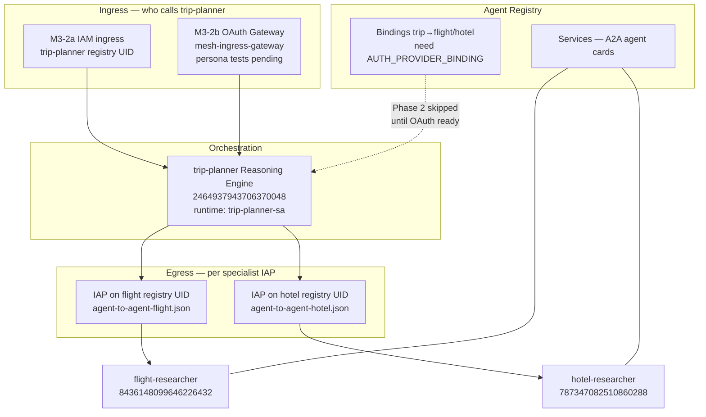
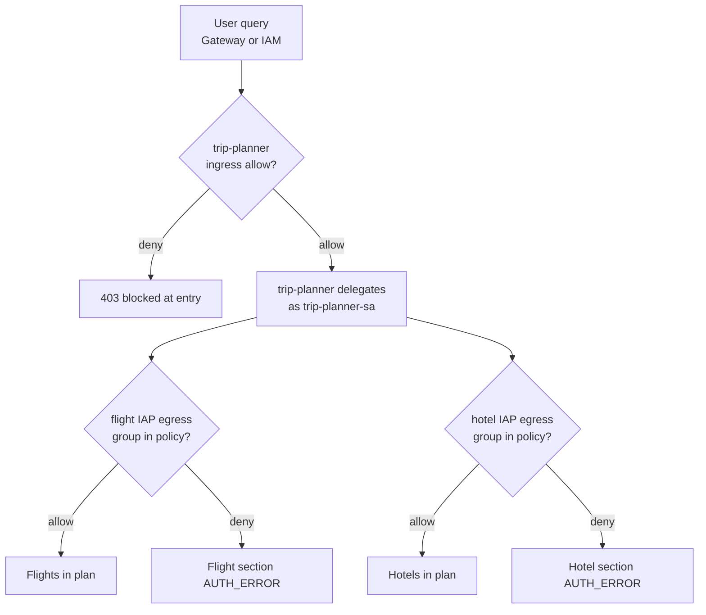
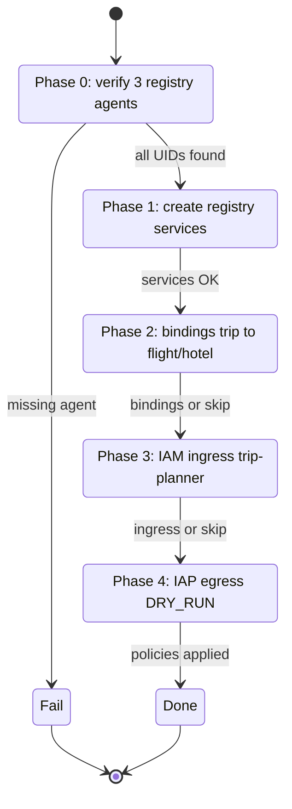
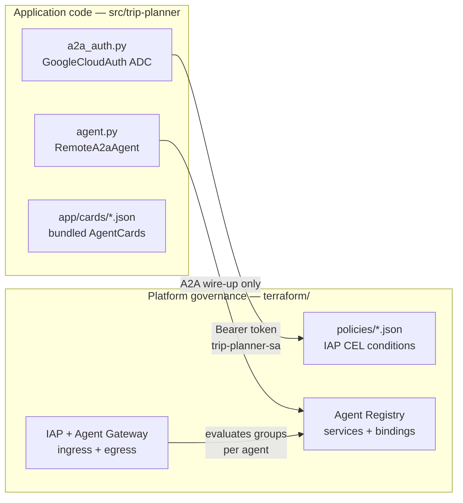
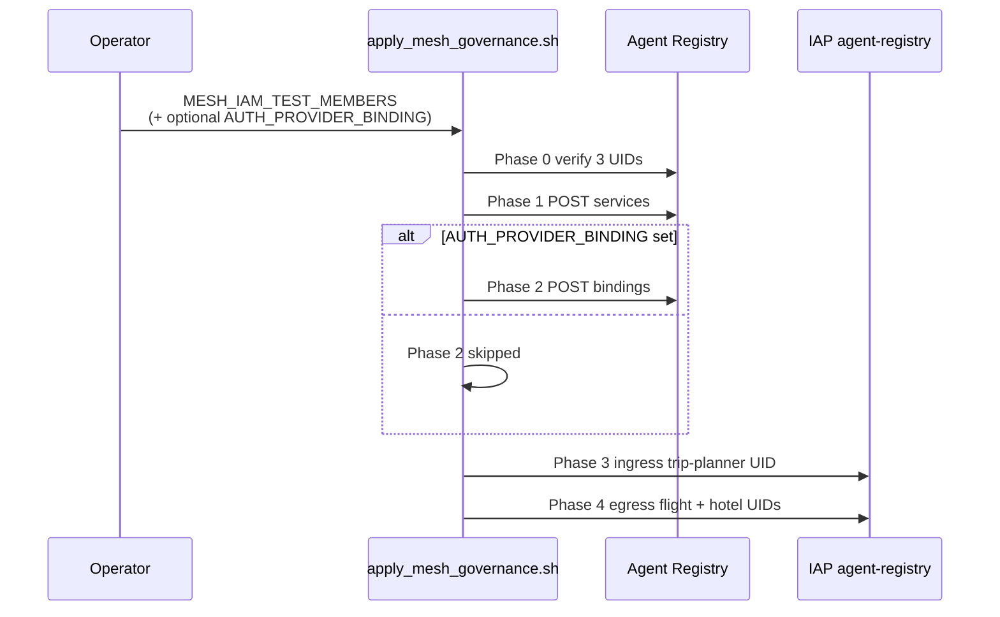

# 04 — Mesh governance

Enterprise demo: **authorization is per agent**, not only at the entry point. Enforcement lives on **Agent Platform** (Agent Registry, IAP, Agent Gateway)—not in custom Python auth modules. This guide is **diagram-first** with embedded micro-tutorials for junior engineers.

**Previous:** [03 — Auth gateway](03-auth-gateway.md) | **Next:** [05 — Gateway policy demo](05-gateway-policy-demo.md) | **Start:** [00 — Overview](00-overview.md)

---

## What you will learn

- How **Agent Registry** relates to **Reasoning Engines** and why IAP uses registry UIDs
- The **governance stack** (ingress, orchestration, egress, registry)
- The **persona matrix** and how a user query flows through allow/deny checks
- How `apply_mesh_governance.sh` phases work as a **state machine**
- How to read the **CEL expression** in `agent-to-agent-flight.json` in plain English
- **DRY_RUN vs enforce** for IAP egress and gateway delegate auth
- What belongs in **code** vs **platform** (and what not to reintroduce in Python)

---

## Concepts (In plain English)

### Reasoning Engine vs Registry UID vs engine ID

Three names, one trip-planner—do not swap them in commands.

| Concept                | Trip-planner example                                 | Plain English                                                  |
| ---------------------- | ---------------------------------------------------- | -------------------------------------------------------------- |
| **Reasoning Engine**   | Managed runtime hosting the ADK app                  | “The running agent container in Agent Runtime.”                |
| **Engine ID**          | `2464937943706370048`                                | Numeric ID in deploy URLs, playground, `agents-cli run --url`. |
| **Registry agent UID** | `agentregistry-00000000-0000-0000-951b-1e5d969e3b7b` | Catalog ID for governance: IAP, ingress, bindings.             |

**IAP always uses the registry UID** with `--resource-type=agent-registry` and values from [`terraform/registry/mesh-agents.env`](../../terraform/registry/mesh-agents.env). Passing an engine ID to `--agent=` will fail or target the wrong resource.

All three mesh agents (live engine IDs):

| Agent             | Engine ID             | Registry UID variable         |
| ----------------- | --------------------- | ----------------------------- |
| flight-researcher | `8436148099646226432` | `FLIGHT_REGISTRY_AGENT`       |
| hotel-researcher  | `787347082510860288`  | `HOTEL_REGISTRY_AGENT`        |
| trip-planner      | `2464937943706370048` | `TRIP_PLANNER_REGISTRY_AGENT` |

### Governance stack

Authorization is layered: who may **enter** trip-planner, who trip-planner may **call**, and what the **registry** records about services and bindings.



### How to read this diagram — how-to-read-this-diagram-how-t (1)

- **Ingress** (top) gates callers reaching trip-planner—IAM today, OAuth Gateway when M3-2b is fully wired.
- **Orchestration** is application A2A only; trip-planner delegates but does not implement persona logic in Python.
- **Egress** (middle-right) is **per specialist**: flight and hotel each have their own IAP policy on **registry UIDs**.
- **Registry** (bottom) holds services (agent cards) and optional **bindings** from trip-planner to specialists.
- Dotted **Bindings** line means Phase 2 is **blocked** until you set `AUTH_PROVIDER_BINDING`.

| Layer       | Controls                                                       | Repo location                         |
| ----------- | -------------------------------------------------------------- | ------------------------------------- |
| Ingress     | Who can call trip-planner                                      | Phase 3 of `apply_mesh_governance.sh` |
| Egress      | Which end-user groups may reach each specialist via delegation | `terraform/policies/`                 |
| Registry    | UIDs, services, bindings                                       | `terraform/registry/mesh-agents.env`  |
| Application | A2A orchestration only                                         | `src/trip-planner/app/`               |

### Persona matrix and flow

Platform policies map **Google Groups** to allow/deny per agent. Local unit tests (`test_a2a_mesh.py`) cover wiring only—not live group membership.

| Persona            | trip-planner | flight-researcher | hotel-researcher |
| ------------------ | :----------: | :---------------: | :--------------: |
| `mesh-full-user`   |    allow     |       allow       |      allow       |
| `mesh-flight-user` |    allow     |       allow       |       deny       |
| `mesh-hotel-user`  |    allow     |       deny        |      allow       |
| `mesh-deny-user`   |     deny     |       deny        |       deny       |



### How to read this diagram — how-to-read-this-diagram-how-t (2)

- **First diamond** is ingress: `mesh-deny-user` should fail here once OAuth/IAM ingress is enforced.
- **Delegate** means trip-planner calls specialists over A2A; platform evaluates **end-user group claims**, not Python env vars.
- **Flight and hotel checks are independent**—`mesh-flight-user` may get flights but hotel AUTH_ERROR.
- **AUTH_ERROR** in a plan section indicates egress denied that specialist call, not necessarily total request failure.
- Full persona tests need OAuth Gateway + real Google Groups ([05 — Gateway policy demo](05-gateway-policy-demo.md)); gateways exist but tests may still be pending.

### apply_mesh_governance.sh as a state machine

The script runs **five phases** in order. Each phase has entry conditions and may **skip** instead of fail.



### How to read this diagram — how-to-read-this-diagram-how-t (3)

- **Phase 0** is a hard gate: if deploy did not register agents, the script exits—fix deploy ([02 — IAM deploy](02-iam-deploy.md)) first.
- **Phase 1** idempotently creates registry **services** from cards in `terraform/registry/cards/`.
- **Phase 2** transitions to “create bindings” **only** when `AUTH_PROVIDER_BINDING` is set; otherwise it **skips** (expected for M3-2b deferral).
- **Phase 3** adds IAM ingress on **`TRIP_PLANNER_REGISTRY_AGENT`** when `MESH_IAM_TEST_MEMBERS` is exported.
- **Phase 4** always applies egress policy JSON via IAP **`--resource-type=agent-registry`**; gateway DRY_RUN→enforce is a separate human step ([05](05-gateway-policy-demo.md)).

| Phase | Action                                     | Typical status                            |
| ----- | ------------------------------------------ | ----------------------------------------- |
| 0     | Verify flight, hotel, trip registry UIDs   | Done after deploy                         |
| 1     | Create registry services (A2A agent cards) | Done (3 services)                         |
| 2     | trip-planner→flight/hotel bindings         | **Blocked** until `AUTH_PROVIDER_BINDING` |
| 3     | IAM ingress on trip-planner                | Done when `MESH_IAM_TEST_MEMBERS` set     |
| 4     | IAP egress on flight/hotel                 | Applied; start in **DRY_RUN**             |

### CEL in agent-to-agent-flight.json (plain English)

Template: [`terraform/policies/agent-to-agent-flight.json`](../../terraform/policies/agent-to-agent-flight.json).

```json
"expression": "'mesh-full-user' in api.getAttribute('authorization.permissions', []) || 'mesh-flight-user' in api.getAttribute('authorization.permissions', [])"
```

**Micro-tutorial — read the policy line by line:**

1. **`roles/iap.egressor` + `TRIP_PLANNER_AGENT_PRINCIPAL` member** — Only the **trip-planner agent principal** (resolved from `mesh-agents.env`) may attempt egress to flight-researcher. Random users or other agents are not in this binding.
2. **`api.getAttribute('authorization.permissions', [])`** — Ask the platform: “What permission strings arrived with this delegated call?” (populated when gateway delegate auth propagates group claims—M3-2b path).
3. **`'mesh-full-user' in ...`** — Allow if the end user is in the **full access** group.
4. **`|| 'mesh-flight-user' in ...`** — Or allow if the end user is in the **flight-only** group.
5. **Implicit deny** — If neither string is present (e.g. `mesh-hotel-user` or `mesh-deny-user`), the condition fails and IAP blocks egress to flight—even if ingress to trip-planner succeeded.

Hotel policy mirrors this pattern with `mesh-full-user` and `mesh-hotel-user`. `resolve_iap_policies.sh` substitutes principal placeholders before `gcloud beta iap web set-iam-policy`.

### Code vs platform responsibility

Do **not** reintroduce env-var personas or custom delegate auth in Python—platform IAP and Gateway enforce access.



### How to read this diagram — how-to-read-this-diagram-how-t (4)

- **Left (code)** orchestrates and attaches tokens; it does **not** decide mesh-full vs mesh-flight.
- **`a2a_auth.py`** satisfies “authenticated caller is trip-planner-sa”; IAP CEL decides “end user group allowed for this specialist.”
- **Right (platform)** owns the persona matrix—changes go to policy JSON and gateway config, not `if group in os.environ`.
- **AgentCards** describe specialists for A2A discovery; registry **services** publish governance-facing cards separately in Phase 1.
- Removing `mesh_auth` Python modules was intentional—see [`docs/notes/2026-06-21-a2a-mesh-refactor.md`](../notes/2026-06-21-a2a-mesh-refactor.md).

---

## Prerequisites

| Requirement               | Notes                                                                     |
| ------------------------- | ------------------------------------------------------------------------- |
| Agents deployed           | [02 — IAM deploy](02-iam-deploy.md) — order flight → hotel → trip-planner |
| IAM ingress (recommended) | [03 — Auth gateway](03-auth-gateway.md)                                   |
| `gcloud` beta IAP         | `gcloud beta iap web ...`                                                 |
| ADC                       | `gcloud auth application-default login`                                   |
| Project access            | `yexperiment` / `asia-northeast1`                                         |

```bash
source terraform/registry/mesh-agents.env
# Confirm trip-planner registry UID:
echo "${TRIP_PLANNER_REGISTRY_AGENT}"
# agentregistry-00000000-0000-0000-951b-1e5d969e3b7b
```

---

## Walkthrough

### Micro-tutorial 1 — Discover registry agents

**Goal:** Confirm deploy registered all three agents under expected UIDs.

```bash
source terraform/registry/mesh-agents.env
TOKEN="$(gcloud auth application-default print-access-token)"
curl -sS -H "Authorization: Bearer ${TOKEN}" \
  "https://agentregistry.googleapis.com/v1alpha/projects/${PROJECT}/locations/${REGION}/agents" \
  | jq '.agents[] | {uid, displayName}'
```

Use hostname **`agentregistry.googleapis.com`** (global API host)—not `{region}-agentregistry.googleapis.com`.

Session notes: [`docs/notes/2026-06-21-m3-discovery.md`](../notes/2026-06-21-m3-discovery.md).

### Micro-tutorial 2 — Run apply_mesh_governance.sh

**Goal:** Walk the state machine phases with optional env gates.

```bash
export MESH_IAM_TEST_MEMBERS="user:you@example.com"
# Phase 2 only when OAuth auth provider exists (M3-2b):
# export AUTH_PROVIDER_BINDING="projects/.../locations/.../authProviders/..."

./terraform/scripts/apply_mesh_governance.sh
```



### How to read this diagram — how-to-read-this-diagram-how-t (5)

- **Operator** supplies env vars; the script does not prompt interactively.
- **Phase 0–1** talk to **Agent Registry REST** (`agentregistry.googleapis.com`).
- **Phase 2 alt** is the OAuth gate—without `AUTH_PROVIDER_BINDING`, bindings are deferred, not an error.
- **Phase 3–4** use **`gcloud beta iap web`** with **`--resource-type=agent-registry`** and UIDs from `mesh-agents.env`.
- Phase 4 applies policies resolved from templates; review **DRY_RUN** audit logs before enforce.

### Micro-tutorial 3 — Manual IAP set-iam-policy (reference)

Phase 4 runs this automatically; use manually if you need to re-apply one specialist.

```bash
./terraform/scripts/resolve_iap_policies.sh
source terraform/registry/mesh-agents.env

gcloud beta iap web set-iam-policy terraform/policies/agent-to-agent-flight.resolved.json \
  --project="${PROJECT}" --region="${REGION}" \
  --resource-type=agent-registry --agent="${FLIGHT_REGISTRY_AGENT}"

gcloud beta iap web set-iam-policy terraform/policies/agent-to-agent-hotel.resolved.json \
  --project="${PROJECT}" --region="${REGION}" \
  --resource-type=agent-registry --agent="${HOTEL_REGISTRY_AGENT}"
```

**Notice:** `--agent=` is the **registry UID**, e.g. `agentregistry-00000000-0000-0000-8ad9-56c0770a61aa` for flight—not `8436148099646226432`.

### Micro-tutorial 4 — DRY_RUN before enforce

**Goal:** Observe would-be denials without blocking production traffic.

1. Apply conditional IAP bindings (Phase 4 / script above).
2. Set gateway delegate authorization to **`iamEnforcementMode: DRY_RUN`** on mesh gateways ([05 — Gateway policy demo](05-gateway-policy-demo.md)).
3. Exercise persona queries; review audit logs for group claim evaluation.
4. Switch to **enforce** when logs match the persona matrix.

Gateways **`mesh-egress-gateway`** and **`mesh-ingress-gateway`** already exist in `yexperiment`; OAuth connector and live persona tests may still be pending.

---

## Verify

| Test                                 | Expected                                                   | Status                              |
| ------------------------------------ | ---------------------------------------------------------- | ----------------------------------- |
| Registry lists 3 agents              | flight, hotel, trip UIDs match `mesh-agents.env`           | After deploy                        |
| Phase 1 services                     | trip-planner, flight-researcher, hotel-researcher services | After script                        |
| Phase 2 bindings                     | trip-planner→flight/hotel                                  | **Pending** `AUTH_PROVIDER_BINDING` |
| IAM smoke ([03](03-auth-gateway.md)) | 200 / 403 by member                                        | After Phase 3                       |
| `mesh-full-user` via gateway         | Full trip plan                                             | Pending M3-2b OAuth persona path    |
| `mesh-flight-user`                   | Flights OK; hotel AUTH_ERROR                               | Pending M3-2b                       |
| `mesh-hotel-user`                    | Hotels OK; flight AUTH_ERROR                               | Pending M3-2b                       |
| `mesh-deny-user`                     | Blocked at ingress                                         | Pending M3-2b                       |

```bash
./terraform/scripts/check_mesh_gateway_status.sh
```

Exit **0** indicates gateway + policy prerequisites are satisfied for the live demo in guide 05.

Acceptance checklist: [`docs/notes/ACCEPTANCE.md`](../notes/ACCEPTANCE.md).

---

## Troubleshooting

| Symptom                     | Likely cause                                         | Fix                                                                                |
| --------------------------- | ---------------------------------------------------- | ---------------------------------------------------------------------------------- |
| Phase 0 missing agent       | Deploy without registry registration                 | Redeploy with `--agent-identity` / correct SA; re-run discovery                    |
| Phase 2 skipped             | No `AUTH_PROVIDER_BINDING`                           | Expected until M3-2b OAuth auth provider is configured                             |
| IAP set-iam-policy fails    | Wrong `--agent=` (engine ID vs registry UID)         | Use `FLIGHT_REGISTRY_AGENT` / `HOTEL_REGISTRY_AGENT` from env file                 |
| Egress allows everyone      | Still in DRY_RUN                                     | Review logs; move gateway auth to enforce when ready                               |
| 401 on A2A despite policies | trip-planner runtime identity                        | Deploy orchestrator with **`trip-planner-sa`**, not `--agent-identity`             |
| Persona tests fail          | Groups not created or gateway OAuth incomplete       | Create Google Groups; finish [05 — Gateway policy demo](05-gateway-policy-demo.md) |
| CEL always denies           | Missing `authorization.permissions` on delegate path | Complete OAuth gateway + delegate auth extension                                   |

---

## Appendix: Further reading

1. [Agent Registry](https://docs.cloud.google.com/gemini-enterprise-agent-platform/govern/agent-registry)
2. [Create IAM agent policies](https://docs.cloud.google.com/gemini-enterprise-agent-platform/govern/policies/assign-identity-iam)
3. [Agent Gateway overview](https://docs.cloud.google.com/gemini-enterprise-agent-platform/govern/gateways/agent-gateway-overview)
4. [Delegate authorization](https://docs.cloud.google.com/gemini-enterprise-agent-platform/govern/gateways/delegate-authorization)
5. [Test policies](https://docs.cloud.google.com/gemini-enterprise-agent-platform/govern/policies/test-policies)

---

## Curriculum checkpoint

You now have the path: **local dev → deploy → ingress auth → mesh governance → gateway demo**.

Return to **[00 — Overview](00-overview.md)** for the glossary, or continue to **[05 — Gateway policy demo](05-gateway-policy-demo.md)** for live OAuth + DRY_RUN→enforce.
