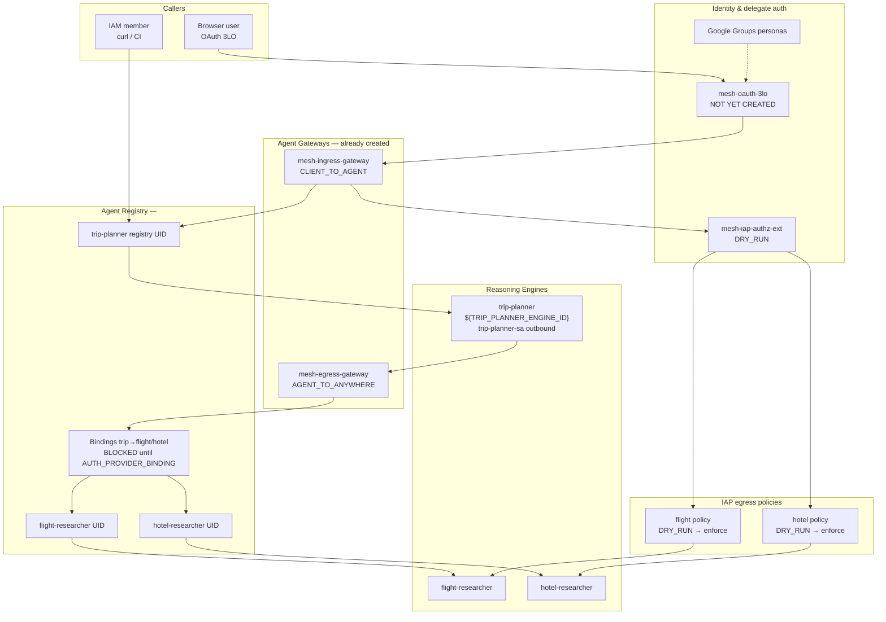
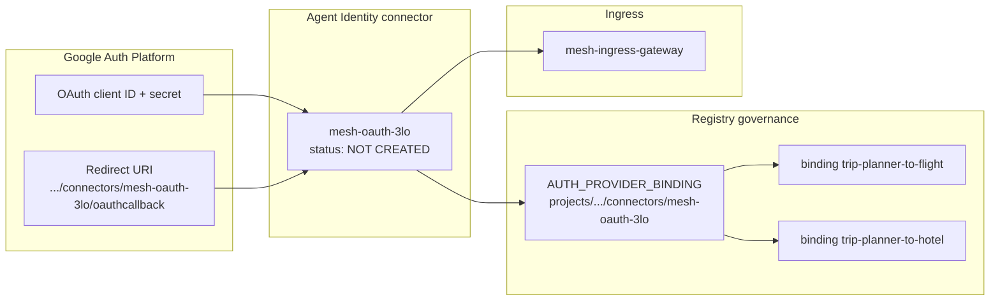
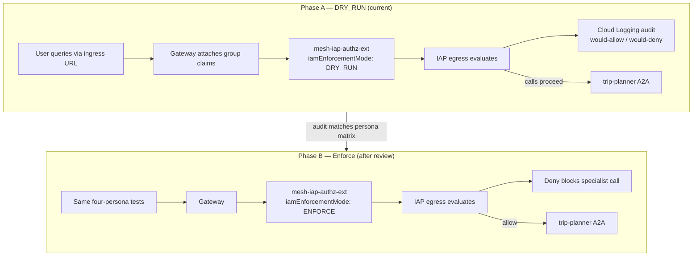
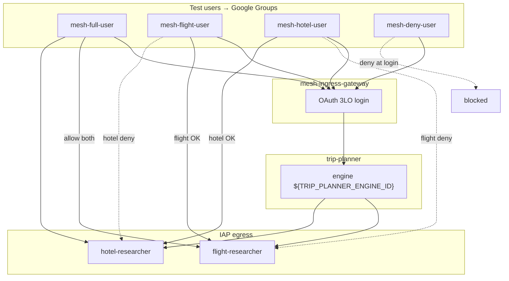
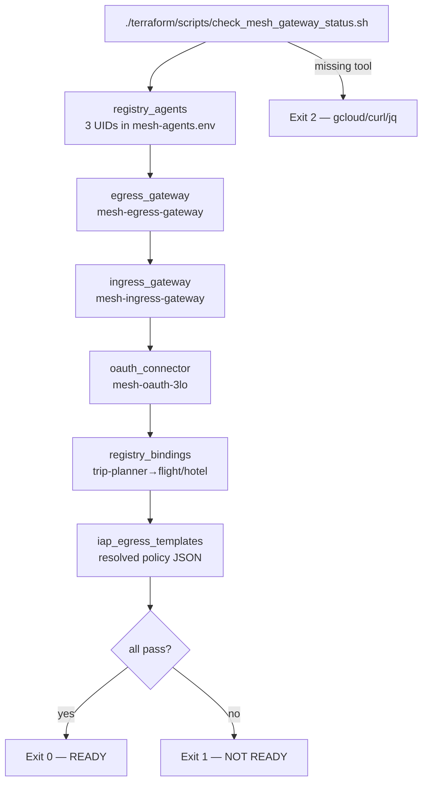

# 05 — Agent Gateway + Agent Policy demo

Live demonstration of **Agent Gateway** (OAuth ingress) and **Agent Policy** (IAM egress + delegate authorization) for the trip-planner mesh. This guide uses a **diagram-first** path: understand the stack, run automation, test personas in **DRY_RUN**, then switch to **enforce**.

**Previous:** [04 — Mesh governance](04-mesh-governance.md) | **Start:** [00 — Overview](00-overview.md)

---

## What you will learn

- How **egress** and **ingress** Agent Gateways fit into the full governance stack
- How **OAuth 3LO** connects humans to trip-planner and why the connector is a separate step
- How **delegate authorization** (`mesh-iap-authz-ext`) bridges gateway identity to IAP egress
- How **DRY_RUN** differs from **enforce** and when to flip the switch
- How to verify readiness with `check_mesh_gateway_status.sh` and run the four-persona test matrix

---

## Concepts

### Full gateway + policy stack

**In plain English:** Humans enter through the **ingress gateway**. Trip-planner orchestrates work and calls specialists through the **egress gateway** and registry. IAP policies on each registry agent decide whether a given user's groups may reach flight or hotel. Delegate authorization copies the user's identity from the gateway into those IAP decisions. Scripts in `terraform/scripts/` automate creation and verification; YAML templates live under `terraform/gateway/`.



### How to read this diagram — how-to-read-this-diagram-how-t (1)

- **Top split** — humans use OAuth + ingress gateway; machines use IAM directly to trip-planner registry ingress (guide 03).
- **Dashed OAuth box** — connector `mesh-oauth-3lo` is the missing piece; without it, browser login cannot complete.
- **mesh-iap-authz-ext** — sits between gateway user context and IAP egress evaluation; currently audit-only.
- **BIND dashed note** — `apply_mesh_governance.sh` Phase 2 skips bindings until `AUTH_PROVIDER_BINDING` is exported.
- **trip-planner-sa** — orchestrator still uses this service account for outbound A2A until M3-2b bindings and agent-identity migration finish.

### Egress vs ingress gateways

**In plain English:** **Ingress** (`mesh-ingress-gateway`) is the front door for browser users—`CLIENT_TO_AGENT`. **Egress** (`mesh-egress-gateway`) governs agent-initiated calls—`AGENT_TO_ANYWHERE`—from trip-planner to specialists via the registry. Both already exist in `<your-gcp-project>` / `asia-northeast1`.

| Gateway                              | Path             | Purpose                                       |
| ------------------------------------ | ---------------- | --------------------------------------------- |
| **Egress** (`mesh-egress-gateway`)   | Agent → anywhere | Governed A2A from orchestrator to specialists |
| **Ingress** (`mesh-ingress-gateway`) | Client → agent   | Human OAuth entry to trip-planner only        |

Templates: [`terraform/gateway/`](../../terraform/gateway/).

### OAuth 3LO connector concept

**In plain English:** OAuth 3LO means Google, the user, and your app all participate in login. The **connector** (`mesh-oauth-3lo`) stores the OAuth client ID/secret and handles the redirect callback URL. Once it exists, you set `AUTH_PROVIDER_BINDING` so registry bindings know which auth provider supplies user group claims.



### How to read this diagram — how-to-read-this-diagram-how-t (2)

- **Console → Connector** — you create an OAuth client manually; secrets are never committed to git.
- **Redirect URI** — printed by `setup_agent_gateway.sh` when `--with-oauth` is requested; must match exactly.
- **NOT CREATED** — current demo state; readiness check fails `oauth_connector` until Phase 2 runs.
- **AUTH_PROVIDER_BINDING** — environment variable consumed by `apply_mesh_governance.sh` Phase 2.
- **Bindings unlock** — without the connector + binding export, trip-planner→specialist registry bindings stay skipped.

### Delegate authorization and DRY_RUN vs enforce

**In plain English:** **Delegate authorization** forwards the signed-in user's identity from the gateway to IAP so egress policies can answer "may _this user_ trigger a flight call?" **DRY_RUN** (`iamEnforcementMode: DRY_RUN` on `mesh-iap-authz-ext`) records what would happen without blocking. **Enforce** applies denials for real—use it only after audit logs show the correct `authorization.permissions` for all four personas.



### How to read this diagram — how-to-read-this-diagram-how-t (3)

- **Phase A is safe default** — wrong policies show up in logs before users are blocked.
- **mesh-iap-authz-ext already exists** — in DRY_RUN; you flip enforce in console or by updating the extension YAML and re-importing.
- **Egress IAP policies** — separate JSON files under `terraform/policies/`; also start in DRY_RUN via `apply_mesh_governance.sh` Phase 4.
- **Arrow between phases** — do not enforce until four-persona DRY_RUN results match the matrix below.
- **Deny blocks specialist call** — user may still get a partial trip plan with an AUTH_ERROR section for the denied specialist.

### Persona matrix (four Google Groups)

**In plain English:** Each test user belongs to one group. Groups map to allow/deny on flight and hotel registry agents. `mesh-deny-user` should fail at ingress once OAuth is wired; until then, focus on egress signals in DRY_RUN logs.

| Persona            | trip-planner ingress | flight-researcher | hotel-researcher |
| ------------------ | :------------------: | :---------------: | :--------------: |
| `mesh-full-user`   |        allow         |       allow       |      allow       |
| `mesh-flight-user` |        allow         |       allow       |       deny       |
| `mesh-hotel-user`  |        allow         |       deny        |      allow       |
| `mesh-deny-user`   |         deny         |       deny        |       deny       |



### How to read this diagram — how-to-read-this-diagram-how-t (4)

- **Four group nodes** — create matching Google Groups and add one test user each before persona testing.
- **mesh-deny-user dashed block** — expected at ingress OAuth once connector + ingress binding are live.
- **Solid vs dashed specialist edges** — solid = allow path; dashed = deny (AUTH_ERROR or blocked under enforce).
- **Single orchestrator** — all allowed personas still enter through trip-planner only.
- **DRY_RUN first** — dashed denies may appear only in logs until enforce mode is enabled.

### Readiness check flow

**In plain English:** `check_mesh_gateway_status.sh` is the automation gate for CI and `/loop`. It runs six checks against live APIs and exits **0** only when all pass. Today, expect `oauth_connector` and `registry_bindings` to fail until OAuth Phase 2 completes.



### How to read this diagram — how-to-read-this-diagram-how-t (5)

- **Sequential checks** — script runs all six even if early ones fail; summary lists each `[pass]` or `[fail]`.
- **Expected failures today** — C4 and C5 until OAuth connector + `AUTH_PROVIDER_BINDING` + governance re-apply.
- **Exit 0** — safe to proceed to persona DRY_RUN tests and enforce flip.
- **Exit 1** — read failed line items; fix upstream step before demo sign-off.
- **`--json` flag** — same checks, machine-readable for loops and CI (`jq .` on output).

---

## Prerequisites

| Requirement    | Notes                                                                             |
| -------------- | --------------------------------------------------------------------------------- |
| M3-2a complete | Agents deployed; registry services exist; IAM ingress applied                     |
| M3-2b partial  | Gateways + `mesh-iap-authz-ext` exist; OAuth connector pending                    |
| Google Groups  | `mesh-full-user`, `mesh-flight-user`, `mesh-hotel-user`, `mesh-deny-user`         |
| OAuth client   | Google Auth Platform project `<your-gcp-project>`; redirect URI from setup script |
| ADC            | `gcloud auth application-default login`                                           |
| Live engine    | trip-planner `${TRIP_PLANNER_ENGINE_ID}`; update `mesh-agents.env` if recreated   |

---

## Walkthrough

### Step 1 — Check current status

```bash
./terraform/scripts/check_mesh_gateway_status.sh
```

**Exit codes:**

| Code  | Meaning                                        |
| ----- | ---------------------------------------------- |
| **0** | All checks passed — READY                      |
| **1** | One or more checks failed — NOT READY          |
| **2** | Missing dependency (`gcloud`, `curl`, or `jq`) |

**Worked example (typical mid-demo output):**

```text
  [pass] registry_agents: 3 mesh registry agents present
  [pass] egress_gateway: mesh-egress-gateway exists
  [pass] ingress_gateway: mesh-ingress-gateway exists
  [fail] oauth_connector: missing connector mesh-oauth-3lo
  [fail] registry_bindings: found 0/2 bindings (need AUTH_PROVIDER_BINDING + apply)
  [pass] iap_egress_templates: resolved IAP policy files present
NOT READY: 2 check(s) failed
```

JSON variant:

```bash
./terraform/scripts/check_mesh_gateway_status.sh --json | jq .
```

### Step 2 — Confirm gateways (idempotent)

Gateways **already exist**; this step is safe to re-run and skips creation when present.

```bash
./terraform/scripts/setup_agent_gateway.sh
```

Creates or skips:

- `mesh-egress-gateway` — template [`mesh-egress-gateway.yaml`](../../terraform/gateway/mesh-egress-gateway.yaml)
- `mesh-ingress-gateway` — template [`mesh-ingress-gateway.yaml`](../../terraform/gateway/mesh-ingress-gateway.yaml)
- `mesh-iap-authz-ext` — template [`mesh-iap-authz-extension.yaml`](../../terraform/gateway/mesh-iap-authz-extension.yaml) with `iamEnforcementMode: DRY_RUN`

### Step 3 — Create OAuth connector (requires secrets)

**Micro-tutorial:** This is the first action that touches secrets. Do not commit client IDs or secrets.

1. Create an OAuth client in Google Auth Platform for project `<your-gcp-project>`.
2. Add the redirect URI printed by the script:

   ```text
   https://iamconnectorcredentials.googleapis.com/v1/projects/<your-gcp-project>/locations/asia-northeast1/connectors/mesh-oauth-3lo/oauthcallback
   ```

3. Run:

```bash
export OAUTH_CLIENT_ID="your-client-id.apps.googleusercontent.com"
export OAUTH_CLIENT_SECRET="your-client-secret"
./terraform/scripts/setup_agent_gateway.sh --with-oauth
```

The script exports:

```bash
export AUTH_PROVIDER_BINDING="projects/<your-gcp-project>/locations/asia-northeast1/connectors/mesh-oauth-3lo"
```

Grant `roles/iamconnectors.user` to trip-planner agent identity when redeploying with `--agent-identity`.

### Step 4 — Registry bindings + IAP (DRY_RUN)

```bash
export MESH_IAM_TEST_MEMBERS="user:you@example.com"
export AUTH_PROVIDER_BINDING="projects/<your-gcp-project>/locations/asia-northeast1/connectors/mesh-oauth-3lo"
./terraform/scripts/apply_mesh_governance.sh
```

Or combine setup + governance:

```bash
export OAUTH_CLIENT_ID="..."
export OAUTH_CLIENT_SECRET="..."
./terraform/scripts/setup_agent_gateway.sh --with-oauth --apply-governance
```

Phase 2 creates `trip-planner-to-flight` and `trip-planner-to-hotel` bindings. Phase 4 applies IAP egress policies in DRY_RUN.

### Step 5 — Redeploy trip-planner with gateway config

After gateways and connector exist, redeploy trip-planner with `--agent-identity` and gateway binding. **Gateway binding is irreversible** on an engine—use a test engine if unsure. Outbound A2A continues via `trip-planner-sa` until M3-2b bindings fully replace that path.

### Step 6 — DRY_RUN persona tests

1. Confirm `mesh-iap-authz-ext` is **Audit-only** (`iamEnforcementMode: DRY_RUN`).
2. Sign in as each test user via the **ingress gateway URL**.
3. Prompt: `Plan NYC to SFO with flights and hotels.`
4. Review Cloud Logging for delegate authorization audit entries.

| Persona            | Expected (DRY_RUN)                                            |
| ------------------ | ------------------------------------------------------------- |
| `mesh-full-user`   | Flights + hotels in response; logs show allow both            |
| `mesh-flight-user` | Flights OK; hotel denied or AUTH_ERROR; logs show hotel deny  |
| `mesh-hotel-user`  | Hotels OK; flight denied or AUTH_ERROR; logs show flight deny |
| `mesh-deny-user`   | Blocked at ingress once OAuth path is live                    |

Record results in [`docs/archive/yexperiment-poc/2026-06-21-m3-platform-tests.md`](../archive/yexperiment-poc/2026-06-21-m3-platform-tests.md).

### Step 7 — Switch to enforce

When DRY_RUN logs show correct `authorization.permissions` for all personas:

1. Update gateway authorization extension to **Enforce** (or set `iamEnforcementMode` to enforce in YAML and re-import).
2. Re-run the four-persona tests from Step 6.
3. Re-run readiness:

```bash
./terraform/scripts/check_mesh_gateway_status.sh
```

---

## Verify

```bash
# Human-readable gate
./terraform/scripts/check_mesh_gateway_status.sh
# all [pass] → READY (exit 0)

# CI / loop JSON
./terraform/scripts/check_mesh_gateway_status.sh --json | jq .
```

| Script                                           | Purpose                                           |
| ------------------------------------------------ | ------------------------------------------------- |
| `terraform/scripts/setup_agent_gateway.sh`       | Create gateways, OAuth connector, authz extension |
| `terraform/scripts/check_mesh_gateway_status.sh` | Readiness gate for CI / loop                      |
| `terraform/scripts/apply_mesh_governance.sh`     | Registry bindings + IAP policies                  |

---

## Troubleshooting

| Symptom                                             | Fix                                                                               |
| --------------------------------------------------- | --------------------------------------------------------------------------------- |
| `check_mesh_gateway_status` fails `registry_agents` | Update `TRIP_PLANNER_REGISTRY_AGENT` in `mesh-agents.env` after engine recreate   |
| `oauth_connector` fails                             | Run `setup_agent_gateway.sh --with-oauth` with valid client ID/secret             |
| `registry_bindings` fails                           | Export `AUTH_PROVIDER_BINDING` before `apply_mesh_governance.sh`                  |
| Gateway import permission denied                    | Enable `networkservices.googleapis.com`; confirm project allowlist                |
| Phase 2 bindings skipped                            | Export `AUTH_PROVIDER_BINDING` before `apply_mesh_governance.sh`                  |
| 401 on A2A                                          | Trip-planner may need `trip-planner-sa` until bindings + agent-identity migration |
| OAuth redirect mismatch                             | Use exact callback URL from setup script output                                   |
| DRY_RUN logs wrong persona                          | Verify Google Group membership before flipping to enforce                         |

---

## Appendix: Further reading

- [Agent Gateway overview](https://docs.cloud.google.com/gemini-enterprise-agent-platform/govern/gateways/agent-gateway-overview)
- [Set up Agent Gateway](https://docs.cloud.google.com/gemini-enterprise-agent-platform/govern/gateways/set-up-agent-gateway)
- [Delegate authorization](https://docs.cloud.google.com/gemini-enterprise-agent-platform/govern/gateways/delegate-authorization)
- [Policies overview](https://docs.cloud.google.com/gemini-enterprise-agent-platform/govern/policies/overview)
- [Monitor Agent Gateway](https://docs.cloud.google.com/gemini-enterprise-agent-platform/govern/gateways/monitor-agent-gateway)
